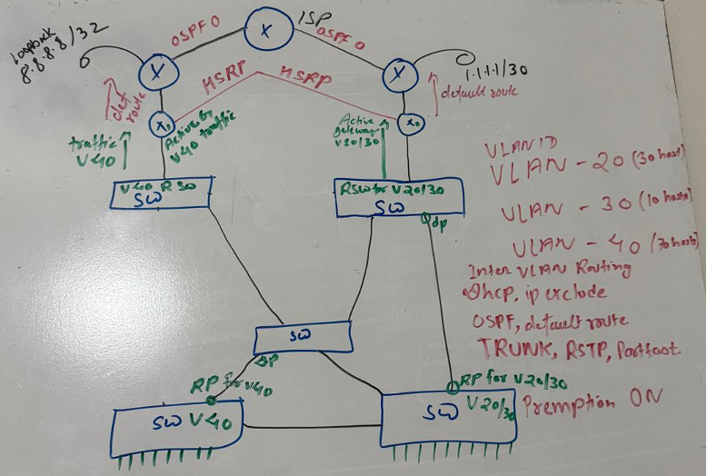
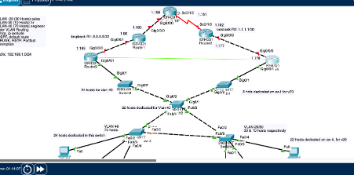

# Virtual Local Area Networks (VLANs)

This section documents my understanding and hands-on implementation of **Virtual Local Area Networks (VLANs)** using Cisco switches.

VLANs allow a physical switched network to be logically divided into multiple separate **Layer 2 broadcast domains**. I used VLANs in my lab to separate different departments while allowing them to share the same physical switching infrastructure.

---

## Topics Covered

- What is a VLAN?
- Why VLANs are used
- Broadcast domains
- VLAN IDs
- Access ports
- VLAN creation and naming
- Assigning switch ports to VLANs
- VLAN verification
- Access-port traffic
- IEEE 802.1Q trunking
- Native VLAN
- Allowed VLANs on trunks
- Access ports vs trunk ports
- Inter-VLAN communication
- Router-on-a-Stick
- Default gateways
- VLAN troubleshooting
- VLSM addressing
- Cisco Packet Tracer implementation
- Network design and planning
- Hands-on VLAN lab
- Verification commands
- Layer 2 and Layer 3 troubleshooting

---

# 1. What Is a VLAN?

A **VLAN (Virtual Local Area Network)** is a logical separation of devices within a switched network.

Without VLANs, devices connected to the same Layer 2 network normally belong to the same **broadcast domain**.

VLANs allow us to divide a physical switched network into multiple logical broadcast domains.

For example:

```text
                   SWITCH
              ┌──────────────┐
Sales PC ─────┤ VLAN 20      │
Sales PC ─────┤ VLAN 20      │
              │              │
HR PC ────────┤ VLAN 30      │
HR PC ────────┤ VLAN 30      │
              │              │
Engineer PC ──┤ VLAN 40      │
              └──────────────┘
```

The physical switch remains the same, but the devices are logically separated into different VLANs.

---

# 2. Why Do We Use VLANs?

VLANs provide several important benefits in network design.

## 2.1 Reduce Broadcast Traffic

Each VLAN creates its own **broadcast domain**.

A broadcast generated by a device in VLAN 20 is forwarded only to ports that belong to VLAN 20. It is not automatically forwarded into VLAN 30 or VLAN 40.

```text
VLAN 20 Broadcast
       |
       v
+-------------------+
|      Switch       |
|                   |
| VLAN 20  ---> YES |
| VLAN 30  ---> NO  |
| VLAN 40  ---> NO  |
+-------------------+
```

This helps limit unnecessary broadcast traffic.

---

## 2.2 Logical Network Segmentation

Devices can be grouped according to their department or function rather than simply by their physical location.

For example:

| VLAN | Department |
|---|---|
| VLAN 20 | Sales |
| VLAN 30 | HR |
| VLAN 40 | Engineering |

Sales, HR, and Engineering can therefore use the same physical switching infrastructure while remaining logically separated at Layer 2.

---

## 2.3 Security and Segmentation

VLANs provide network segmentation.

For example:

```text
VLAN 20 - SALES
```

and:

```text
VLAN 30 - HR
```

are separate Layer 2 broadcast domains.

A device in VLAN 20 cannot directly communicate at Layer 2 with a device in VLAN 30.

Communication between different VLANs requires a **Layer 3 device**, such as:

- Router
- Layer 3 switch

> **Important:** VLANs provide segmentation, but VLANs alone should not be considered a complete security control. Layer 3 controls such as ACLs or firewall policies can be used to control traffic between VLANs.

---

## 2.4 Easier Network Management

VLANs make it easier to organise users and devices according to their purpose.

For example:

```text
VLAN 20 = SALES
VLAN 30 = HR
VLAN 40 = ENGINEERING
```

A network administrator can identify the purpose of each logical network without relying only on the physical location of the devices.

---

# 3. VLAN IDs

A VLAN is identified using a numerical **VLAN ID**.

For IEEE 802.1Q VLAN tagging, the VLAN identifier field is **12 bits**, providing VLAN ID values from:

```text
0 - 4095
```

However:

```text
VLAN 0    = Reserved
VLAN 1    = Common default VLAN on Cisco switches
VLAN 2-4094 = VLAN IDs available for normal VLAN identification
VLAN 4095 = Reserved
```

Therefore, the commonly used VLAN ID range for normal VLAN identification is:

```text
1 - 4094
```

In my lab, I used:

```text
VLAN 20  → SALES
VLAN 30  → HR
VLAN 40  → ENGINEERING
```

The VLAN name is primarily used to make the configuration easier for administrators to understand.

The switch identifies the VLAN primarily by its **VLAN ID**.

---

# 4. Creating VLANs on a Cisco Switch

VLANs are created from **global configuration mode** on a Cisco switch.

In my lab, I created three VLANs:

| VLAN ID | VLAN Name | Department |
|---|---|---|
| 20 | SALES | Sales |
| 30 | HR | Human Resources |
| 40 | ENGINEERING | Engineering |

## Enter Global Configuration Mode

```cisco
enable
configure terminal
```

## Create VLAN 20 - SALES

```cisco
vlan 20
name SALES
exit
```

## Create VLAN 30 - HR

```cisco
vlan 30
name HR
exit
```

## Create VLAN 40 - ENGINEERING

```cisco
vlan 40
name ENGINEERING
exit
```

The VLAN ID creates the logical VLAN, while the `name` command assigns a descriptive name.

---

# 5. Verifying VLAN Configuration

After creating the VLANs, I can verify them using:

```cisco
show vlan brief
```

Example:

```text
VLAN Name                             Status    Ports
---- -------------------------------- --------- -------------------------------
1    default                          active
20   SALES                            active
30   HR                               active
40   ENGINEERING                      active
```

At this stage, the VLANs exist on the switch, but end devices still need to be assigned to the appropriate VLAN using **access ports**.

> **Key takeaway:** Creating a VLAN and assigning a switch port to that VLAN are two separate configuration steps.

---

# 6. Access Ports

An **access port** carries traffic for a single VLAN and is commonly used to connect end devices such as:

- PCs
- Printers
- Servers
- IP phones
- Other endpoint devices

Creating a VLAN does not automatically place switch interfaces into that VLAN.

The required interfaces must be explicitly assigned.

---

# 7. Configuring an Access Port

Example:

```cisco
interface GigabitEthernet1/0/1
switchport mode access
switchport access vlan 20
no shutdown
```

## What Do These Commands Mean?

### `switchport mode access`

```cisco
switchport mode access
```

This configures the interface as a static **Layer 2 access port**.

### `switchport access vlan 20`

```cisco
switchport access vlan 20
```

This assigns the access port to **VLAN 20**.

Therefore, traffic entering this interface from the connected end device belongs to VLAN 20.

---

# 8. Configuring Multiple Access Ports

If several consecutive interfaces belong to the same VLAN, an interface range can be used.

For example:

```cisco
interface range GigabitEthernet1/0/1-4
switchport mode access
switchport access vlan 20
no shutdown
```

This assigns all four interfaces to VLAN 20.

For HR:

```cisco
interface range GigabitEthernet1/0/5-8
switchport mode access
switchport access vlan 30
no shutdown
```

For Engineering:

```cisco
interface range GigabitEthernet1/0/9-12
switchport mode access
switchport access vlan 40
no shutdown
```

> **Note:** Interface numbers depend on the switch model and physical topology. Always verify which interfaces connect to which end devices before assigning VLAN membership.

---

# 9. Verifying Access Port VLAN Membership

The first command I use is:

```cisco
show vlan brief
```

Example:

```text
VLAN Name                             Status    Ports
---- -------------------------------- --------- -------------------------------
1    default                          active
20   SALES                            active    Gi1/0/1, Gi1/0/2, Gi1/0/3, Gi1/0/4
30   HR                               active    Gi1/0/5, Gi1/0/6, Gi1/0/7, Gi1/0/8
40   ENGINEERING                      active    Gi1/0/9, Gi1/0/10, Gi1/0/11, Gi1/0/12
```

For detailed information about a specific switchport:

```cisco
show interfaces GigabitEthernet1/0/1 switchport
```

This can be used to verify:

- Administrative mode
- Operational mode
- Access VLAN
- Trunking characteristics

---

# 10. Access Port Traffic

An end device connected to an access port normally sends and receives ordinary **untagged Ethernet frames**.

The switch associates those frames with the VLAN configured on the access port.

```text
PC
 |
 | Untagged Ethernet frame
 |
 v
Gi1/0/1
ACCESS VLAN 20
 |
 v
+----------------+
|     SWITCH     |
|    VLAN 20     |
+----------------+
```

The end device therefore does not normally need to understand 802.1Q VLAN tagging.

> **Key takeaway:** The switchport determines which VLAN an untagged frame from an access-connected end device belongs to.

---

# 11. VLAN Trunking

An **access port** normally carries traffic for one VLAN.

However, network devices such as switches often need to transport traffic belonging to **multiple VLANs across the same physical link**.

This is accomplished using a **trunk link**.

```text
          VLAN 20
          VLAN 30
          VLAN 40
             |
             v
       +-----------+
       |  Switch 1 |
       +-----------+
             |
             | 802.1Q TRUNK
             | VLANs 20,30,40
             |
       +-----------+
       |  Switch 2 |
       +-----------+
          /   |   \
         /    |    \
      VLAN20 VLAN30 VLAN40
```

Without trunking, separate physical links would be required to carry each VLAN between switches.

---

# 12. IEEE 802.1Q

Cisco switches commonly use **IEEE 802.1Q (dot1q)** to identify VLAN traffic travelling across trunk links.

802.1Q adds VLAN information to an Ethernet frame so that the receiving switch can determine which VLAN the frame belongs to.

Conceptually:

```text
Access Link:

[ Ethernet Frame ]
```

On an 802.1Q trunk:

```text
[ Ethernet ][ 802.1Q Tag ][ Frame Information ]
                    |
                    +---- VLAN ID
```

For example, if Switch 1 sends a frame belonging to VLAN 20 across a trunk, the 802.1Q information identifies that frame as belonging to **VLAN 20**.

The receiving switch reads the VLAN information and places the frame into the correct VLAN.

---

# 13. Configuring a Trunk Port

Example trunk configuration:

```cisco
interface GigabitEthernet1/0/24
switchport mode trunk
no shutdown
```

The command:

```cisco
switchport mode trunk
```

configures the interface to operate as a static Layer 2 trunk.

---

# 14. Allowing Specific VLANs on a Trunk

A trunk can be configured to carry only selected VLANs.

For example:

```cisco
interface GigabitEthernet1/0/24
switchport mode trunk
switchport trunk allowed vlan 20,30,40
```

This allows VLANs 20, 30 and 40 across the trunk.

This can be verified using:

```cisco
show interfaces trunk
```

Example:

```text
Port        Mode    Encapsulation  Status     Native vlan
Gi1/0/24    on      802.1q         trunking   1

Port        Vlans allowed on trunk
Gi1/0/24    20,30,40
```

> **Key takeaway:** A VLAN may exist on a switch but still fail to communicate across a trunk if that VLAN is not allowed on the trunk.

---

# 15. Native VLAN

802.1Q trunks also have a **native VLAN**.

On many Cisco configurations, the default native VLAN is:

```text
VLAN 1
```

Traffic belonging to the native VLAN is normally sent **untagged** across an 802.1Q trunk.

A different native VLAN can be configured:

```cisco
interface GigabitEthernet1/0/24
switchport trunk native vlan 99
```

If VLAN 99 is being used as the native VLAN, it should exist on the relevant switches:

```cisco
vlan 99
name NATIVE
```

Both ends of the trunk should use the **same native VLAN**.

A native VLAN mismatch can cause unexpected behaviour and may generate switch warnings.

---

# 16. Verifying Trunk Configuration

One of the most useful commands is:

```cisco
show interfaces trunk
```

I can also inspect a particular interface:

```cisco
show interfaces GigabitEthernet1/0/24 switchport
```

These commands help verify:

- Whether the interface is actually trunking
- Trunk encapsulation
- Native VLAN
- VLANs allowed across the trunk
- VLANs currently active on the trunk

---

# 17. Access Port vs Trunk Port

| Feature | Access Port | Trunk Port |
|---|---|---|
| Typical purpose | Connect an end device | Connect network devices |
| VLANs carried | Normally one | Multiple |
| End-device traffic | Normally untagged | Multiple VLANs identified using 802.1Q |
| Example | PC → Switch | Switch → Switch |
| Configuration | `switchport mode access` | `switchport mode trunk` |

> **Key takeaway:** Access ports place end devices into VLANs, while trunk links allow multiple VLANs to travel between network devices over a single physical connection.

---

# 18. Inter-VLAN Communication

Each VLAN represents a separate **Layer 2 broadcast domain** and normally uses a separate **IP subnet**.

For example:

| VLAN | Department | Example Subnet |
|---|---|---|
| VLAN 20 | SALES | `192.168.20.0/24` |
| VLAN 30 | HR | `192.168.30.0/24` |
| VLAN 40 | ENGINEERING | `192.168.40.0/24` |

A host in VLAN 20 cannot communicate directly at Layer 2 with a host in VLAN 30 because they belong to different VLANs and different IP networks.

Communication between VLANs requires **Layer 3 routing**.

This process is called **Inter-VLAN Routing**.

---

# 19. Why Is a Layer 3 Device Required?

Consider these two hosts:

```text
PC-A
VLAN 20
192.168.20.10/24
        |
        |
     SWITCH
        |
        X
        |
PC-B
VLAN 30
192.168.30.10/24
```

PC-A determines that:

```text
192.168.30.10
```

is outside its local subnet.

Instead of trying to communicate directly with PC-B, PC-A sends the packet toward its **default gateway**.

A router or Layer 3 switch then routes the packet from the VLAN 20 network into the VLAN 30 network.

Conceptually:

```text
VLAN 20
   |
   v
Default Gateway
   |
   v
Layer 3 Routing
   |
   v
VLAN 30
```

---

# 20. Router-on-a-Stick

One method of providing inter-VLAN routing is **Router-on-a-Stick (ROAS)**.

With Router-on-a-Stick, one physical router interface is divided into multiple logical **subinterfaces**.

Each subinterface represents a different VLAN.

```text
               VLAN 20
               VLAN 30
               VLAN 40
                  |
             +----------+
             |  SWITCH  |
             +----------+
                  |
                  | 802.1Q TRUNK
                  |
             Gi0/0/1
             +----------+
             |  ROUTER  |
             +----------+
                | | |
                | | +-- Gi0/0/1.40
                | +---- Gi0/0/1.30
                +------ Gi0/0/1.20
```

The link between the switch and router operates as an **802.1Q trunk** because traffic from multiple VLANs must cross the same physical connection.

---

# 21. Configuring Router-on-a-Stick

Assume the router connects to the switch using:

```text
GigabitEthernet0/0/1
```

First, enable the physical interface:

```cisco
interface GigabitEthernet0/0/1
no shutdown
```

The physical interface itself does not require an IP address when its subinterfaces are being used for the VLAN gateways.

## VLAN 20 Subinterface

```cisco
interface GigabitEthernet0/0/1.20
encapsulation dot1Q 20
ip address 192.168.20.1 255.255.255.0
```

## VLAN 30 Subinterface

```cisco
interface GigabitEthernet0/0/1.30
encapsulation dot1Q 30
ip address 192.168.30.1 255.255.255.0
```

## VLAN 40 Subinterface

```cisco
interface GigabitEthernet0/0/1.40
encapsulation dot1Q 40
ip address 192.168.40.1 255.255.255.0
```

The command:

```cisco
encapsulation dot1Q 20
```

associates that router subinterface with **802.1Q VLAN 20 traffic**.

---

# 22. Default Gateways

Hosts in each VLAN must use a Layer 3 interface in their own subnet as their **default gateway**.

Using the example above:

| VLAN | Host Network | Default Gateway |
|---|---|---|
| VLAN 20 | `192.168.20.0/24` | `192.168.20.1` |
| VLAN 30 | `192.168.30.0/24` | `192.168.30.1` |
| VLAN 40 | `192.168.40.0/24` | `192.168.40.1` |

For example:

```text
PC-A

IP Address:      192.168.20.10
Subnet Mask:     255.255.255.0
Default Gateway: 192.168.20.1
```

The default gateway provides the Layer 3 path out of the local VLAN/subnet.

---

# 23. Switch Port Toward the Router

Because the router is handling multiple VLANs, the switch interface connected to it must operate as a trunk.

For example:

```cisco
interface GigabitEthernet1/0/24
switchport mode trunk
switchport trunk allowed vlan 20,30,40
```

The path now becomes:

```text
PC VLAN 20
    |
Access Port
    |
  Switch
    |
802.1Q Trunk
    |
Router Subinterface .20
    |
Layer 3 Routing
    |
Router Subinterface .30
    |
802.1Q Trunk
    |
  Switch
    |
Access Port
    |
PC VLAN 30
```

> **Key takeaway:** VLANs separate networks at Layer 2. Inter-VLAN routing provides controlled Layer 3 communication between those separate networks.

---

# 24. VLAN Verification and Troubleshooting

After configuring VLANs, access ports, trunks and inter-VLAN routing, I verify each layer separately rather than assuming the entire configuration is working.

---

## 24.1 Verify VLANs Exist

```cisco
show vlan brief
```

I use this command to confirm:

- Required VLAN IDs exist
- VLAN names are correct
- VLANs are active
- Access ports are assigned to the expected VLANs

---

## 24.2 Verify the Switchport Configuration

For a specific interface:

```cisco
show interfaces GigabitEthernet1/0/1 switchport
```

This helps confirm whether the interface is operating as an access port or trunk and which VLAN is associated with it.

---

## 24.3 Verify Trunk Links

```cisco
show interfaces trunk
```

I use this command to check:

- Whether the interface is actually trunking
- Native VLAN
- VLANs allowed on the trunk
- VLANs that are active
- VLANs currently forwarding across the trunk

Example:

```text
Port        Mode    Encapsulation  Status     Native vlan
Gi0/1       on      802.1q         trunking   1

Port        Vlans allowed on trunk
Gi0/1       20,30,40
```

If VLAN 40 is missing from the allowed VLAN list, VLAN 40 traffic cannot cross that trunk.

---

## 24.4 Verify Router Subinterfaces

On a router performing Router-on-a-Stick:

```cisco
show ip interface brief
```

Example:

```text
Interface              IP-Address       Status    Protocol
Gi0/0/1                unassigned       up        up
Gi0/0/1.20             192.168.20.1     up        up
Gi0/0/1.30             192.168.30.1     up        up
Gi0/0/1.40             192.168.40.1     up        up
```

The subinterfaces should normally show:

```text
up    up
```

---

# 25. Test Connectivity in Stages

Instead of immediately testing a distant device, I troubleshoot progressively.

```text
PC
 |
 | 1. Check local IP configuration
 v
Default Gateway
 |
 | 2. Ping the gateway
 v
Router
 |
 | 3. Verify inter-VLAN routing
 v
Remote VLAN
 |
 | 4. Ping the destination
 v
Destination Host
```

For example:

```text
ping 192.168.20.1
```

If the host cannot reach its own default gateway, I investigate the local VLAN, access port, trunk, IP addressing and router subinterface before troubleshooting higher-level routing.

---

# 26. Common VLAN Problems

| Problem | What I Would Check |
|---|---|
| PC cannot reach its gateway | IP address, subnet mask, access VLAN, switchport and router subinterface |
| PCs in the same VLAN cannot communicate | VLAN membership, addressing and physical/interface status |
| VLAN works on one switch but not another | Trunk configuration and allowed VLAN list |
| One VLAN cannot cross a trunk | `show interfaces trunk` and allowed VLANs |
| Inter-VLAN communication fails | Default gateway and Layer 3 routing configuration |
| Router subinterface is not working | Physical interface, `encapsulation dot1Q`, VLAN ID and IP configuration |
| Native VLAN mismatch | Native VLAN configuration on both ends of the trunk |

---

# 27. My Troubleshooting Approach

My preferred troubleshooting process is:

1. **Check physical/interface status**
2. **Check the host IP configuration**
3. **Verify VLAN creation**
4. **Verify access-port membership**
5. **Verify the trunk**
6. **Verify the default gateway**
7. **Verify router or Layer 3 interfaces**
8. **Test with `ping`**
9. **Follow the packet path until I find where communication stops**

> **Key takeaway:** Configuration commands tell me what I intended to build. Verification commands tell me what the network is actually doing.

---

# 28. Hands-On VLAN Lab

After learning the VLAN concepts individually, I implemented them in Cisco Packet Tracer as part of a larger enterprise-style network.

The goal of the lab was to segment different departments using VLANs and separate IP subnets while maintaining connectivity through the network infrastructure.

---

# 29. Lab VLAN Design

I used the following VLANs:

| VLAN ID | Department | Purpose |
|---|---|---|
| 20 | SALES | Sales department devices |
| 30 | HR | Human Resources devices |
| 40 | ENGINEERING | Engineering devices |
| 50 | SERVER | Server infrastructure |

---

# 30. VLSM Addressing Plan

Instead of assigning a `/24` network to every VLAN, I subnetted the available `192.168.1.0/24` address space using **Variable Length Subnet Masking (VLSM)**.

The addressing plan was:

| VLAN | Network | Prefix | Subnet Mask | Usable Host Range | Broadcast |
|---|---|---|---|---|---|
| VLAN 40 - Engineering | `192.168.1.0` | `/25` | `255.255.255.128` | `192.168.1.1 - 192.168.1.126` | `192.168.1.127` |
| VLAN 20 - Sales | `192.168.1.128` | `/27` | `255.255.255.224` | `192.168.1.129 - 192.168.1.158` | `192.168.1.159` |
| VLAN 30 - HR | `192.168.1.160` | `/28` | `255.255.255.240` | `192.168.1.161 - 192.168.1.174` | `192.168.1.175` |
| VLAN 50 - Server | `192.168.1.192` | `/27` | `255.255.255.224` | `192.168.1.193 - 192.168.1.222` | `192.168.1.223` |

> VLSM allowed me to allocate different subnet sizes according to the number of hosts required by each department instead of wasting address space by giving every VLAN the same subnet size.

---

# 31. Creating the VLANs

On the switches, I created the departmental VLANs:

```cisco
configure terminal

vlan 20
 name SALES

vlan 30
 name HR

vlan 40
 name ENGINEERING

vlan 50
 name SERVER
```

I then verified the VLAN database using:

```cisco
show vlan brief
```

---

# 32. Configuring the Trunk

The uplink needed to transport traffic from multiple VLANs, so I configured it as an 802.1Q trunk.

Example:

```cisco
interface GigabitEthernet0/1
 switchport mode trunk
 switchport trunk allowed vlan 20,30,40,50
```

I verified the trunk using:

```cisco
show interfaces trunk
```

During troubleshooting, this command became particularly useful because it allowed me to compare:

- VLANs allowed on the trunk
- VLANs allowed and active
- VLANs in the Spanning Tree forwarding state

---

# 33. What I Learned From the Lab

This lab helped me understand that successful VLAN communication depends on several configurations working together.

```text
Correct VLAN
     |
     v
Correct Access Port
     |
     v
Correct Trunk
     |
     v
Correct VLAN Allowed
     |
     v
Correct Layer 3 Gateway
     |
     v
Successful Communication
```

A VLAN existing in the VLAN database does **not** automatically mean that its traffic can travel through the entire network.

Each part of the forwarding path must be verified.

---

# 34. Network Design and Planning

Before implementing the network in Cisco Packet Tracer, I planned the topology and major network technologies on a whiteboard.

The design included:

- VLAN segmentation
- Inter-VLAN routing
- Trunking
- HSRP
- OSPF
- DHCP
- RSTP
- PortFast
- Gateway redundancy
- Upstream ISP connectivity



This initial design helped me visualise how the Layer 2 switching, Layer 3 routing, redundancy and dynamic routing components would work together before implementing the topology.

I also learned the importance of using verification commands to confirm the actual operational state of the network instead of assuming that a configuration command was successful.

> **My main takeaway:** Understand the packet path, configure each layer deliberately, and verify every stage.

---

# 35. Cisco Packet Tracer Implementation

After completing the initial whiteboard design, I implemented the network topology in **Cisco Packet Tracer**.



The Packet Tracer implementation allowed me to move from conceptual network design to practical configuration and testing.

During the implementation, I configured and tested technologies including:

- VLAN segmentation
- Access and trunk ports
- Inter-VLAN routing
- DHCP and excluded address ranges
- Layer 2 redundancy
- RSTP and PortFast
- Gateway redundancy using HSRP
- OSPF dynamic routing
- Default routing toward the ISP
- End-to-end connectivity

This lab also gave me experience troubleshooting the network layer by layer rather than treating the topology as a single configuration.

---

# 36. Skills Demonstrated

Through this VLAN study and lab, I developed practical experience with:

- Designing VLAN-based network segmentation
- Creating and naming VLANs on Cisco switches
- Configuring access ports
- Configuring IEEE 802.1Q trunk links
- Controlling which VLANs are allowed across trunks
- Understanding tagged and untagged Ethernet traffic
- Understanding native VLAN behaviour
- Designing IPv4 subnets using VLSM
- Configuring Router-on-a-Stick for inter-VLAN routing
- Configuring and understanding default gateways
- Verifying VLAN and trunk operation
- Troubleshooting Layer 2 connectivity
- Troubleshooting Layer 3 connectivity
- Using Cisco IOS verification commands
- Implementing VLANs in Cisco Packet Tracer
- Planning network topology before implementation

---

# 37. Key Commands

The following Cisco IOS commands became particularly useful during my VLAN study and lab work.

## VLAN Verification

```cisco
show vlan brief
```

## Trunk Verification

```cisco
show interfaces trunk
```

## Switchport Verification

```cisco
show interfaces GigabitEthernet1/0/1 switchport
```

## Router Interface Verification

```cisco
show ip interface brief
```

## View Running Configuration

```cisco
show running-config
```

## Configure a VLAN

```cisco
configure terminal
vlan 20
name SALES
```

## Configure an Access Port

```cisco
interface GigabitEthernet1/0/1
switchport mode access
switchport access vlan 20
no shutdown
```

## Configure a Trunk

```cisco
interface GigabitEthernet1/0/24
switchport mode trunk
switchport trunk allowed vlan 20,30,40,50
no shutdown
```

---

# 38. Layer 2 and Layer 3 Relationship

One of the most important concepts I learned is that VLANs and routing solve different problems.

### Layer 2

VLANs provide:

```text
Logical segmentation
        |
        v
Separate broadcast domains
```

### Layer 3

Routing provides:

```text
Communication between
different IP networks
```

Therefore:

```text
VLAN 20
192.168.20.0/24
      |
      | Layer 2
      v
  VLAN 20
      |
      | Layer 3 Routing
      v
  VLAN 30
      |
      | Layer 2
      v
192.168.30.0/24
```

This distinction is fundamental when troubleshooting VLAN networks.

---

# 39. VLAN Packet Flow

A simplified packet flow between two hosts in different VLANs can be represented as:

```text
PC-A
VLAN 20
192.168.20.10
      |
      | Access Port
      v
   SWITCH
      |
      | 802.1Q Trunk
      v
Layer 3 Gateway
192.168.20.1
      |
      | Routing
      v
192.168.30.1
      |
      | 802.1Q Trunk
      v
   SWITCH
      |
      | Access Port
      v
PC-B
VLAN 30
192.168.30.10
```

The packet cannot simply move directly from VLAN 20 to VLAN 30 at Layer 2.

It must pass through a Layer 3 gateway.

---

# 40. Important VLAN Concepts

The following relationships are important to remember:

```text
VLAN
  ↓
Layer 2 segmentation
  ↓
Broadcast domain
  ↓
Usually associated with an IP subnet
  ↓
Default gateway provides Layer 3 exit
  ↓
Router / Layer 3 switch performs inter-VLAN routing
```

---

# 41. Key Lessons Learned

One of the most important lessons from this study was that **VLAN configuration is not just about creating a VLAN**.

Successful communication depends on the entire forwarding path being configured correctly.

```text
End Device
    |
    v
Access Port
    |
    v
VLAN Membership
    |
    v
802.1Q Trunk
    |
    v
Allowed VLAN
    |
    v
Layer 3 Gateway
    |
    v
Routing
    |
    v
Destination Network
```

When troubleshooting, I learned to verify each stage individually rather than changing multiple configurations at once.

---

# 42. Troubleshooting Mindset

My VLAN troubleshooting mindset is based on following the packet path.

Instead of asking:

> "Why isn't the network working?"

I break the problem into smaller questions:

```text
Is the interface physically up?
        |
        v
Is the host correctly addressed?
        |
        v
Is the correct VLAN created?
        |
        v
Is the switchport assigned correctly?
        |
        v
Is the trunk working?
        |
        v
Is the VLAN allowed?
        |
        v
Is the native VLAN correct?
        |
        v
Is the default gateway correct?
        |
        v
Is Layer 3 routing working?
        |
        v
Can the destination be reached?
```

This approach makes troubleshooting more systematic and reduces unnecessary configuration changes.

---

# 43. Final Summary

A **VLAN (Virtual Local Area Network)** provides logical Layer 2 segmentation within a switched network.

VLANs allow a physical network to be divided into separate broadcast domains without requiring a completely separate physical switching infrastructure for every department.

The main concepts I studied include:

- VLAN creation
- VLAN IDs
- VLAN naming
- Broadcast domains
- Access ports
- Access-port VLAN membership
- Untagged Ethernet traffic
- IEEE 802.1Q
- Trunk ports
- Native VLAN
- Allowed VLANs
- Inter-VLAN routing
- Router-on-a-Stick
- Default gateways
- VLSM
- VLAN verification
- VLAN troubleshooting
- Cisco IOS commands
- Cisco Packet Tracer implementation

The most important distinction is:

```text
VLAN
  ↓
Layer 2 segmentation

Routing
  ↓
Layer 3 communication between networks
```

A successful VLAN implementation requires more than simply creating the VLAN.

The entire forwarding path must work:

```text
End Device
    ↓
Access Port
    ↓
VLAN
    ↓
Trunk
    ↓
Allowed VLAN
    ↓
Layer 3 Gateway
    ↓
Routing
    ↓
Destination VLAN
    ↓
Destination Host
```

---

# 44. Key Takeaways

The main concepts I learned from this VLAN study are:

- A VLAN is a logical Layer 2 network.
- Each VLAN represents a separate broadcast domain.
- VLANs provide logical network segmentation.
- VLANs can help organise networks by department or function.
- VLANs alone are not a complete security control.
- A VLAN is identified using a VLAN ID.
- IEEE 802.1Q uses a 12-bit VLAN identifier field.
- VLAN IDs 0 and 4095 are reserved.
- VLAN IDs 1–4094 are commonly used for VLAN identification.
- Creating a VLAN does not automatically assign ports to it.
- Access ports normally carry traffic for one VLAN.
- End devices connected to access ports normally send untagged Ethernet frames.
- The switch associates untagged access-port traffic with the configured access VLAN.
- Trunk ports carry traffic for multiple VLANs.
- IEEE 802.1Q provides VLAN identification across trunk links.
- The native VLAN is normally transmitted untagged on an 802.1Q trunk.
- Both ends of a trunk should use the same native VLAN.
- Trunks can be restricted using an allowed VLAN list.
- Different VLANs normally use different IP subnets.
- Communication between VLANs requires Layer 3 routing.
- Hosts require a default gateway to communicate outside their local subnet.
- Router-on-a-Stick uses router subinterfaces for multiple VLAN gateways.
- VLSM allows different subnet sizes to be allocated according to requirements.
- `show vlan brief` verifies VLAN and access-port membership.
- `show interfaces trunk` verifies trunk operation and VLANs allowed across the trunk.
- `show interfaces <interface> switchport` provides detailed switchport information.
- `show ip interface brief` helps verify Layer 3 interfaces and subinterfaces.
- VLAN troubleshooting should follow the packet path.
- Verification is just as important as configuration.
- Cisco Packet Tracer provides a useful environment for implementing and testing VLAN concepts.

---

# 45. VLAN Learning Progress

Topics studied:

- [x] Introduction to VLANs
- [x] VLAN segmentation
- [x] Broadcast domains
- [x] VLAN IDs
- [x] VLAN creation
- [x] VLAN naming
- [x] Access ports
- [x] Access-port configuration
- [x] Access-port traffic
- [x] VLAN verification
- [x] IEEE 802.1Q
- [x] Trunk ports
- [x] Allowed VLANs
- [x] Native VLAN
- [x] Access vs trunk ports
- [x] Inter-VLAN communication
- [x] Router-on-a-Stick
- [x] Default gateways
- [x] VLSM
- [x] VLAN troubleshooting
- [x] Cisco IOS verification commands
- [x] Cisco Packet Tracer implementation
- [x] Network design and planning
- [x] RSTP
- [x] PortFast
- [x] HSRP
- [x] OSPF
- [x] DHCP
- [x] End-to-end connectivity testing

---

# 46. Practical Lab Evidence

## Network Design


The initial network design was created before implementation to plan VLAN segmentation, Layer 2 switching, Layer 3 routing, redundancy and upstream connectivity.

## Cisco Packet Tracer Topology


The topology was then implemented in Cisco Packet Tracer to test the planned configuration and verify end-to-end connectivity.

---

# 47. Final Reflection

Studying VLANs helped me move beyond simply understanding individual Cisco commands and start thinking about **how traffic actually moves through a network**.

The most valuable part of the practical work was learning to connect:

```text
VLAN
   ↓
Switchport
   ↓
Trunk
   ↓
802.1Q
   ↓
Layer 3 Gateway
   ↓
Routing
   ↓
Destination
```

This helped me develop a more structured approach to network design and troubleshooting.

Rather than changing configurations until connectivity works, I now aim to understand the expected packet path first and then verify each stage of that path.

> **My main takeaway:** Understand the packet path, configure each layer deliberately, and verify what the network is actually doing.

---

## Repository Structure

```text
02-VLAN/
│
├── README.md
│
└── images/
    ├── vlan-network-design-whiteboard.jpg
    └── vlan-packet-tracer-topology.png
```

---

## Technologies and Tools

- Cisco IOS
- Cisco switches
- Cisco routers
- Cisco Packet Tracer
- IEEE 802.1Q
- VLAN
- Inter-VLAN Routing
- Router-on-a-Stick
- VLSM
- RSTP
- PortFast
- HSRP
- OSPF
- DHCP
- Network troubleshooting
