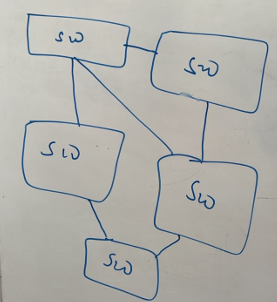

# Spanning Tree Protocol (STP) and Rapid STP (RSTP)

This section documents my understanding and hands-on practice with **Spanning Tree Protocol (STP)** and **Rapid Spanning Tree Protocol (RSTP)**.

STP is used in Layer 2 switched networks to prevent switching loops when redundant links exist between switches.

RSTP improves convergence compared with traditional STP while keeping the same fundamental goal: maintaining a loop-free Layer 2 topology.

---

## Topics Covered

- Why Layer 2 loops occur
- Purpose of STP
- Root Bridge election
- Bridge ID
- Root Path Cost
- Root Ports
- Designated Ports
- Blocking and forwarding behaviour
- BPDU
- STP timers
- STP port states
- RSTP port states
- CST
- PVST
- PVST+
- Rapid PVST+
- Topology changes
- PortFast
- STP verification commands
- Hands-on Packet Tracer lab

---

## Why STP Is Needed

Redundant links are useful because they provide backup paths if a link fails.

However, Layer 2 Ethernet frames do not contain a TTL field like IP packets do.

This means a Layer 2 loop can allow frames to circulate continuously.

For example:

```text
        SW1
       /   \
      /     \
    SW2-----SW3


---

## Root Bridge Election

STP first needs to elect one switch as the **Root Bridge**.

The Root Bridge becomes the reference point for the Layer 2 spanning-tree topology. Other switches determine their best path toward this switch.

STP elects the switch with the **lowest Bridge ID (BID)**.

The Bridge ID is based on:

```text
Bridge ID
   |
   +-- Bridge Priority
   +-- Extended System ID (VLAN ID)
   +-- MAC Address
```

---

## Bridge Priority

The default STP bridge priority is:

```text
32768
```

With the Extended System ID enabled, valid configurable priority values normally increase in steps of:

```text
4096
```

Examples:

```text
0
4096
8192
12288
16384
...
32768
...
61440
```

The switch with the **lowest Bridge ID** becomes the Root Bridge.

If switches have different priorities:

```text
SW1 Priority = 24576
SW2 Priority = 32768
SW3 Priority = 32768
```

then:

```text
SW1 = Root Bridge
```

because SW1 has the lowest priority.

---

## What If the Priorities Are Equal?

If multiple switches have the same STP priority, STP uses the **MAC address as the tie-breaker**.

For example:

```text
SW1
Priority: 32768
MAC:      00:11:11:11:11:11

SW2
Priority: 32768
MAC:      00:22:22:22:22:22
```

Both priorities are equal.

Therefore STP compares the MAC addresses:

```text
00:11:11:11:11:11
        <
00:22:22:22:22:22
```

SW1 has the lower MAC address.

Therefore:

```text
SW1 = Root Bridge
```

---

## Root Bridge Decision Process

The election can be remembered as:

```text
Lowest Bridge ID wins
        |
        +--> Lowest Priority
                  |
                  +--> If tied:
                       Lowest MAC Address
```

---

## Checking the Root Bridge on Cisco IOS

A useful verification command is:

```cisco
show spanning-tree
```

A summary can also be viewed with:

```cisco
show spanning-tree summary
```

My lab output showed the switch operating in:

```text
pvst mode
```

and acting as the Root Bridge for multiple VLANs.

Because PVST maintains a spanning-tree instance per VLAN, a switch can be the Root Bridge for one VLAN while another switch can be the Root Bridge for a different VLAN.

---

> **Key takeaway:** STP begins by electing a Root Bridge. The switch with the lowest Bridge ID wins; priority is compared first, and MAC address is used as the tie-breaker.


---

## STP Port Roles

After the Root Bridge has been elected, STP determines which switch ports should forward traffic and which redundant paths should be prevented from forwarding.

The three important roles to understand are:

```text
Root Port
Designated Port
Blocking / Alternate Port
```

---

## Root Port

Every **non-root switch** selects one Root Port.

The Root Port is the port that provides the **lowest-cost path toward the Root Bridge**.

Example:

```text
              SW1
          ROOT BRIDGE
           /        \
          /          \
        SW2----------SW3
```

If SW2's best path toward SW1 is through its directly connected interface, that interface becomes SW2's:

```text
Root Port (RP)
```

The Root Bridge itself does **not** have a Root Port.

---

## Root Path Cost

STP uses **path cost** to determine the best path toward the Root Bridge.

In general:

```text
Lower STP Cost = Better Path
```

For example:

```text
Path A → Cost 4
Path B → Cost 19
```

STP prefers:

```text
Path A
```

because:

```text
4 < 19
```

The total Root Path Cost is calculated by adding the STP costs of the links along the path toward the Root Bridge.

---

## Designated Port

Each network segment selects one **Designated Port (DP)**.

The Designated Port is the port that provides the best path from that segment toward the Root Bridge.

On the Root Bridge, active ports connected to network segments normally become Designated Ports.

For example:

```text
                SW1
             ROOT BRIDGE
             DP       DP
              |       |
              |       |
             RP       RP
             SW2     SW3
```

SW2 and SW3 use their Root Ports to reach SW1.

SW1's ports toward those switches are Designated Ports.

---

## What Happens to the Redundant Link?

Now consider:

```text
                 SW1
              ROOT BRIDGE
               /      \
              /        \
            SW2--------SW3
```

If both SW2 and SW3 forwarded across every link, a Layer 2 loop could exist.

STP therefore determines which side of the redundant SW2-SW3 segment should be the Designated Port.

The other side does not forward normal user traffic.

In classic STP, this is commonly described as a:

```text
Blocking Port
```

In RSTP terminology, a redundant path may receive the role:

```text
Alternate Port
```

This gives the network redundancy without allowing a Layer 2 forwarding loop.

---

## Simplified STP Decision Process

I can think about STP in this order:

```text
1. Elect the Root Bridge
          ↓
2. Each non-root switch chooses its Root Port
          ↓
3. Each segment chooses its Designated Port
          ↓
4. Remaining redundant ports do not forward
```

So:

```text
Root Bridge
    ↓
Root Ports
    ↓
Designated Ports
    ↓
Block redundant paths
```

---

## Important Distinction: Role vs State

A **port role** describes what job the port has in the spanning-tree topology.

Examples:

```text
Root
Designated
Alternate
```

A **port state** describes what the port is currently allowed to do.

Examples in traditional STP include:

```text
Blocking
Listening
Learning
Forwarding
Disabled
```

We should not confuse a port's **role** with its **state**.

---

> **Key takeaway:** STP creates a loop-free topology by choosing the best paths toward the Root Bridge and preventing unnecessary redundant paths from forwarding traffic.


---

## Bridge Protocol Data Units (BPDUs)

**BPDU (Bridge Protocol Data Unit)** is the control message used by switches participating in Spanning Tree Protocol.

Switches exchange BPDUs so that they can share STP information and collectively determine a loop-free Layer 2 topology.

BPDUs help switches answer questions such as:

```text
Who should be the Root Bridge?
What is the best path toward the Root Bridge?
What is the Root Path Cost?
Which ports should forward?
Has the Layer 2 topology changed?
```

---

## Why Do Switches Send BPDUs?

Without exchanging STP information, switches would not have enough information to make coordinated spanning-tree decisions.

A simplified example is:

```text
                  SW1
                 /   \
                /     \
              SW2-----SW3
```

The switches exchange BPDUs across their links.

Using the information contained in those BPDUs, STP can:

1. Elect a Root Bridge.
2. Calculate paths toward the Root Bridge.
3. Select appropriate port roles.
4. Prevent redundant paths from creating forwarding loops.

---

## Information Carried in a BPDU

STP BPDUs contain information used during the spanning-tree calculation.

Important information includes:

```text
Root Bridge ID
Sender Bridge ID
Root Path Cost
Port information
STP timers
```

Conceptually, a switch can advertise:

```text
"I believe this switch is the Root Bridge,
and my cost to reach it is X."
```

Other switches compare the received STP information with their own information and determine which path is superior.

---

## Superior BPDU

When switches compare STP information, the **better BPDU** is referred to as the superior BPDU.

A simplified comparison starts with:

```text
1. Lowest Root Bridge ID
2. Lowest Root Path Cost
3. Lowest Sender Bridge ID
4. Lowest Sender Port ID
```

Lower values are preferred.

This allows STP to make deterministic decisions when multiple paths exist.

---

## How Often Are BPDUs Sent?

In traditional IEEE 802.1D STP, the Root Bridge normally generates configuration BPDUs every:

```text
2 seconds
```

This interval is known as the:

```text
Hello Time
```

The default STP timers commonly associated with traditional STP are:

```text
Hello Time    = 2 seconds
Forward Delay = 15 seconds
Max Age       = 20 seconds
```

These timers play an important role in traditional STP convergence.

---

## What Happens If BPDUs Stop Arriving?

A switch does not immediately assume that a missing BPDU means the topology has permanently changed.

Traditional STP uses timers to determine whether previously learned spanning-tree information is still valid.

If the relevant BPDU information ages out, STP can recalculate the topology and potentially activate a previously redundant path.

This is one reason traditional STP convergence can take noticeable time.

---

## BPDU Types in Traditional STP

Two important BPDU concepts from traditional STP are:

### Configuration BPDU

Configuration BPDUs carry spanning-tree information used for:

```text
Root Bridge election
Path selection
Port-role decisions
STP timer information
```

### Topology Change Notification (TCN) BPDU

A **TCN BPDU** is associated with notifying the spanning-tree topology that a change has occurred.

For example:

```text
Link failure
     ↓
Topology changes
     ↓
STP must react
     ↓
Topology-change information is propagated
```

The exact topology-change behaviour differs between traditional STP and RSTP, which we will cover separately.

---

## BPDU Verification

A useful starting command when investigating STP is:

```cisco
show spanning-tree
```

This allows me to inspect information such as:

```text
Root ID
Bridge ID
Root Path Cost
Port Roles
Port States
STP timers
```

---

> **Key takeaway:** BPDUs are the communication mechanism that allows switches to collectively build and maintain the spanning-tree topology. STP decisions are not made independently by guessing; switches exchange control information and compare it to determine the best Layer 2 topology.


---

## STP Port States

Traditional **IEEE 802.1D STP** uses several port states while determining whether a switch port should forward traffic.

The five traditional STP port states are:

```text
Disabled
Blocking
Listening
Learning
Forwarding
```

A port may transition through several of these states before it begins forwarding normal Ethernet frames.

---

### Blocking

A port in the **Blocking** state does not forward normal user traffic.

Its purpose is to prevent a redundant Layer 2 path from creating a switching loop.

The port can still receive BPDUs so that STP can monitor the topology.

```text
User Frames:     ❌ Not forwarded
MAC Learning:    ❌ No
BPDU Processing: ✅ Yes
```

---

### Listening

During the **Listening** state, the switch participates in STP calculations but does not yet forward normal traffic.

```text
User Frames:     ❌ Not forwarded
MAC Learning:    ❌ No
BPDU Processing: ✅ Yes
```

The default Forward Delay associated with this transition is:

```text
15 seconds
```

---

### Learning

In the **Learning** state, the switch begins learning source MAC addresses and populating its MAC address table.

However, it still does not forward normal user traffic.

```text
User Frames:     ❌ Not forwarded
MAC Learning:    ✅ Yes
BPDU Processing: ✅ Yes
```

The default Forward Delay is again:

```text
15 seconds
```

---

### Forwarding

Once the port reaches **Forwarding**, it can send and receive normal network traffic.

```text
User Frames:     ✅ Forwarded
MAC Learning:    ✅ Yes
BPDU Processing: ✅ Yes
```

A simplified traditional STP transition is:

```text
Blocking
   ↓
Listening
   ↓
Learning
   ↓
Forwarding
```

The Listening and Learning stages each traditionally use a 15-second Forward Delay.

This is one reason traditional STP can converge relatively slowly.

---

### Disabled

A port in the **Disabled** state does not participate in normal frame forwarding or STP operation.

For example, an administratively shut interface may be disabled.

---

## RSTP Port States

**Rapid Spanning Tree Protocol (IEEE 802.1w)** simplifies the STP state model.

RSTP uses three port states:

```text
Discarding
Learning
Forwarding
```

The traditional STP states:

```text
Disabled
Blocking
Listening
```

are effectively represented by:

```text
Discarding
```

So the comparison becomes:

| Traditional STP | RSTP |
|---|---|
| Disabled | Discarding |
| Blocking | Discarding |
| Listening | Discarding |
| Learning | Learning |
| Forwarding | Forwarding |

---

## Why RSTP Is Faster

Traditional STP relies heavily on timers while transitioning ports toward forwarding.

RSTP introduces mechanisms that allow switches to determine the topology and transition appropriate ports much more rapidly.

Conceptually:

```text
STP
Blocking → Listening → Learning → Forwarding

RSTP
Discarding → Learning → Forwarding
```

RSTP also introduces/uses port roles such as:

```text
Root Port
Designated Port
Alternate Port
Backup Port
```

An **Alternate Port** can provide an alternative path toward the Root Bridge.

If the active path fails, RSTP can often move to the alternative path much faster than traditional STP.

---

## STP Role vs State

This distinction is important:

```text
ROLE  = What job does the port perform?

STATE = What is the port currently allowed to do?
```

For example:

```text
Role:  Root Port
State: Forwarding
```

or:

```text
Role:  Alternate Port
State: Discarding
```

Therefore, **Root, Designated and Alternate** are port roles, while **Discarding, Learning and Forwarding** are RSTP port states.

---

## Verification

On Cisco IOS I can inspect the spanning-tree topology using:

```cisco
show spanning-tree
```

and obtain an overall summary using:

```cisco
show spanning-tree summary
```

During my lab, I used these commands to observe STP behaviour and verify whether interfaces were blocking, learning or forwarding.

> **Key takeaway:** Traditional STP uses Blocking, Listening, Learning and Forwarding during convergence, while RSTP simplifies these into Discarding, Learning and Forwarding and provides mechanisms for substantially faster convergence.


---

## STP Path Cost

After the Root Bridge is elected, switches need to determine the **best path toward the Root Bridge**.

STP uses a metric called:

```text
Path Cost
```

The fundamental rule is:

```text
Lower STP Cost = Better Path
```

Unlike routing protocols such as OSPF, STP is making a **Layer 2 forwarding decision**.

---

## STP Cost and Link Speed

STP assigns a cost to an interface based on its link speed.

Common traditional Cisco/CCNA values are:

| Link Speed | STP Cost |
|---|---:|
| 10 Mbps | 100 |
| 100 Mbps | 19 |
| 1 Gbps | 4 |
| 10 Gbps | 2 |

These are the older values commonly encountered in Cisco learning environments and Packet Tracer.

My notes also distinguish these from the modern IEEE long path-cost values. :contentReference[oaicite:0]{index=0}

---

## Root Path Cost

A switch determines the total cost required to reach the Root Bridge.

Consider:

```text
              SW1
          ROOT BRIDGE
              |
           Cost 4
              |
             SW2
              |
           Cost 4
              |
             SW3
```

SW2 has a Root Path Cost of:

```text
4
```

SW3 reaches the Root Bridge through SW2:

```text
4 + 4 = 8
```

Therefore:

```text
SW2 Root Path Cost = 4
SW3 Root Path Cost = 8
```

STP prefers the path with the lowest total Root Path Cost.

---

## Example With Two Possible Paths

Suppose SW3 has two possible paths toward the Root Bridge:

```text
Path A = Cost 8
Path B = Cost 19
```

STP chooses:

```text
Path A
```

because:

```text
8 < 19
```

The higher-cost redundant path can remain available without being used for normal forwarding.

---

## STP Tie-Breakers

Sometimes two possible paths have the same Root Path Cost.

STP therefore needs additional tie-breakers.

A useful simplified decision order is:

```text
1. Lowest Root Bridge ID
2. Lowest Root Path Cost
3. Lowest Sender Bridge ID
4. Lowest Sender Port ID
```

Lower values win.

For example, if two BPDUs advertise:

```text
Same Root Bridge
Same Root Path Cost
```

STP next compares the Bridge ID of the switches sending those BPDUs.

If those are also tied, the Port ID can break the tie.

---

## OSPF Cost vs STP Cost

Both technologies use the word **cost**, but they solve different problems.

| Feature | OSPF | STP |
|---|---|---|
| Layer | Layer 3 | Layer 2 |
| Purpose | Select best IP route | Select best path toward Root Bridge |
| Lower cost preferred | Yes | Yes |
| Main decision | Routing | Loop-free switching |

This distinction is important because seeing the word `cost` does not automatically mean routing.

My original notes specifically compared OSPF cost with STP cost to reinforce this distinction. :contentReference[oaicite:1]{index=1}

---

## Cisco Verification

To inspect STP path information:

```cisco
show spanning-tree
```

For a particular VLAN:

```cisco
show spanning-tree vlan 20
```

To view an STP summary:

```cisco
show spanning-tree summary
```

STP interface cost can also be manually influenced using an interface-level command such as:

```cisco
spanning-tree cost <value>
```

My notes identify `show spanning-tree`, `show spanning-tree summary`, and `spanning-tree cost <value>` as useful STP verification and configuration commands. :contentReference[oaicite:2]{index=2}

> **Key takeaway:** The Root Bridge is elected using Bridge ID, but the best path **toward** that Root Bridge is primarily selected using Root Path Cost. Lower cost wins.


---

## STP Variants: CST, PVST, PVST+ and Rapid PVST+

Different implementations of Spanning Tree Protocol determine how spanning-tree instances operate across VLANs.

Understanding this becomes particularly important when multiple VLANs exist on the same switched infrastructure.

---

## CST - Common Spanning Tree

**CST (Common Spanning Tree)** uses a single spanning-tree instance for the switched network.

Conceptually:

```text
VLAN 20 ──┐
VLAN 30 ──┼──> One Spanning Tree
VLAN 40 ──┘
```

Because the VLANs share the same spanning-tree topology, they do not independently select different Root Bridges or forwarding paths.

---

## PVST - Per-VLAN Spanning Tree

**PVST (Per-VLAN Spanning Tree)** allows a separate spanning-tree instance to operate for each VLAN.

Conceptually:

```text
VLAN 20 ──> STP Instance 20
VLAN 30 ──> STP Instance 30
VLAN 40 ──> STP Instance 40
VLAN 50 ──> STP Instance 50
```

This means STP decisions can be different for different VLANs.

For example:

```text
VLAN 20 Root Bridge → SW1
VLAN 30 Root Bridge → SW2
```

This can provide more control over Layer 2 forwarding paths.

---

## PVST+

**PVST+** is Cisco's enhancement of per-VLAN spanning tree and provides a separate STP instance for each VLAN while improving interoperability with IEEE spanning-tree environments.

The important idea for my lab is:

```text
One VLAN = One Spanning-Tree Instance
```

Therefore, when troubleshooting a Cisco switched network, I should not automatically assume that every VLAN has the same Root Bridge or the same blocked interfaces.

---

## Rapid PVST+

**Rapid PVST+** combines the per-VLAN behaviour of PVST+ with the faster convergence mechanisms of **RSTP (IEEE 802.1w)**.

Conceptually:

```text
PVST+
   +
RSTP
   ↓
Rapid PVST+
```

This provides:

```text
Separate spanning tree per VLAN
              +
Faster RSTP convergence
```

On Cisco IOS, Rapid PVST+ can commonly be enabled globally with:

```cisco
spanning-tree mode rapid-pvst
```

Verification can then be performed using:

```cisco
show spanning-tree summary
```

---

## My Lab Verification

During my lab, I ran:

```cisco
show spanning-tree summary
```

and received output showing:

```text
Switch is in pvst mode
Root bridge for:
```

The summary contained spanning-tree instances for:

```text
VLAN0001
VLAN0020
VLAN0030
VLAN0040
VLAN0050
```

This helped me understand what **Per-VLAN Spanning Tree** means in practice.

Instead of STP being represented as one single topology for all VLANs, Cisco IOS displayed separate STP information for each VLAN.

My output also showed:

```text
Name                   Blocking   Forwarding   STP Active
VLAN0001                    0          2            2
VLAN0020                    0          2            2
VLAN0030                    0          2            2
VLAN0040                    0          2            2
VLAN0050                    0          2            2
```

Across the five VLANs:

```text
5 VLANs
10 Forwarding Ports
10 STP Active Ports
0 Blocking Ports
```

The output therefore provided practical evidence that STP was operating separately for the VLANs present on the switch.

---

## Per-VLAN Root Bridge Design

Because PVST/PVST+ maintains separate spanning-tree instances, network administrators can intentionally influence the Root Bridge for different VLANs.

For example:

```text
             VLAN 20
             Root = SW1

        SW1-------------SW2
         |               |
         |               |
        SW3-------------SW4

             VLAN 30
             Root = SW2
```

This makes it possible to design Layer 2 forwarding paths according to the network topology instead of allowing every VLAN to necessarily use the same Root Bridge.

---

## Comparison

| Feature | CST | PVST/PVST+ | Rapid PVST+ |
|---|---|---|---|
| STP instances | One | One per VLAN | One per VLAN |
| Per-VLAN Root Bridge | No | Yes | Yes |
| RSTP convergence | No | No | Yes |
| Cisco-oriented implementation | No | Yes | Yes |

> **Key takeaway:** PVST allows STP decisions to be made independently for each VLAN. My `show spanning-tree summary` output demonstrated this directly by displaying separate STP instances for VLANs 1, 20, 30, 40 and 50.


---

## PortFast

**PortFast** is a Cisco STP feature designed primarily for switch ports connected directly to end devices.

Examples include:

```text
PC
Laptop
Server
Printer
```

Normally, STP must make sure a port will not create a Layer 2 loop before allowing it to forward traffic.

For an access port connected to a single end device, waiting for normal STP convergence can unnecessarily delay connectivity.

PortFast allows an eligible port to transition rapidly to the **Forwarding** state.

Conceptually:

```text
Normal STP:

Port Up
   ↓
Listening
   ↓
Learning
   ↓
Forwarding


PortFast:

Port Up
   ↓
Forwarding
```

---

## Configuring PortFast

PortFast can be configured on an interface:

```cisco
interface FastEthernet0/1
 switchport mode access
 spanning-tree portfast
```

It is commonly appropriate for an edge/access port such as:

```text
SW1 Fa0/1
    |
    |
   PC1
```

---

## Where I Should NOT Normally Use PortFast

PortFast should not simply be enabled on links between switches.

For example:

```text
SW1 -------- SW2
```

A switch-to-switch connection can introduce a Layer 2 loop.

STP therefore needs to participate normally on such redundant infrastructure links.

A useful mental model is:

```text
Switch → End Device     PortFast may be appropriate

Switch → Switch         Normal STP/RSTP operation
```

The actual topology and device behaviour should always be considered before enabling PortFast.

---

## PortFast Does Not Disable STP

An important point is:

```text
PortFast ≠ STP disabled
```

PortFast changes how quickly an edge port transitions to forwarding.

The port still participates in spanning-tree protections and can process BPDUs.

This becomes especially important when PortFast is combined with protections such as **BPDU Guard**.

---

## Topology Changes

STP must respond when the Layer 2 topology changes.

Examples include:

```text
A link fails
A switch fails
A previously blocked path becomes necessary
A forwarding interface goes down
A new Layer 2 path becomes available
```

Consider:

```text
          SW1
         /   \
        /     \
      SW2-----SW3
```

One redundant path may not normally forward user traffic.

If an active forwarding path fails:

```text
          SW1
         X   \
             \
      SW2-----SW3
```

STP/RSTP must recalculate the topology so that an appropriate redundant path can become active without creating a loop.

---

## Direct and Indirect Topology Changes

A switch can become aware of a topology change in different ways.

### Direct Topology Change

The switch directly detects that one of its interfaces has changed state.

For example:

```text
SW1 -------- SW2
       X

Physical link fails
```

The connected switches can directly observe the interface failure.

### Indirect Topology Change

Sometimes a switch does not directly observe the original physical failure.

Instead, it detects a change because the expected STP information or BPDUs from another part of the topology change or stop arriving.

Conceptually:

```text
SW1 -------- SW2 -------- SW3
              |
              X
             SW4

SW1 did not directly lose its own link,
but the topology beyond SW2 changed.
```

STP must still eventually adapt to the new Layer 2 topology.

---

## Why RSTP Helps

Traditional STP can depend significantly on timers during convergence.

RSTP improves this process by using faster topology-change and port-role mechanisms.

This is particularly valuable in networks with redundant paths:

```text
Primary Path Fails
        ↓
RSTP detects topology change
        ↓
Alternate path can transition
        ↓
Connectivity restored faster
```

---

## PortFast and Topology Stability

End-user devices frequently connect and disconnect:

```text
Laptop disconnected
PC restarted
Server rebooted
```

These events do not necessarily represent meaningful changes to the switching infrastructure.

Using PortFast appropriately on edge ports helps prevent ordinary endpoint activity from behaving like traditional infrastructure topology changes.

---

## Verification

Useful commands include:

```cisco
show spanning-tree
```

```cisco
show spanning-tree summary
```

For a particular VLAN:

```cisco
show spanning-tree vlan 20
```

These commands help me determine:

```text
Root Bridge
Root Path Cost
Port Roles
Port States
Forwarding interfaces
Blocked/discarding interfaces
```

> **Key takeaway:** PortFast improves edge-port availability, while STP/RSTP continues protecting the Layer 2 topology. When a genuine topology change occurs, spanning tree recalculates the forwarding topology so redundancy can be used without creating loops.


---

# Hands-On STP Lab

After learning the STP concepts, I implemented a redundant Layer 2 topology in Cisco Packet Tracer and used STP to observe how the network prevented switching loops.

## Lab Topology



The topology was designed with multiple redundant switch-to-switch links so that STP would have to make forwarding and blocking decisions.

During the lab, I:

- Identified the Root Bridge
- Verified Root Ports
- Verified Designated Ports
- Observed an Alternate/Blocked port
- Changed the Root Bridge by modifying STP priority
- Configured primary and secondary Root Bridges
- Manipulated path selection using STP cost
- Created VLAN 2 and VLAN 3
- Configured trunks between switches
- Assigned access ports to VLANs
- Verified STP independently for multiple VLANs
- Converted the topology from traditional STP to RSTP
- Configured PortFast on edge ports


---

## Verifying STP Port Roles

I used the following command to inspect the spanning-tree topology:

```cisco
show spanning-tree
```

One of my switches produced the following output for VLAN 1:

```text
VLAN0001
Spanning tree enabled protocol ieee

Root ID    Priority    20481
           Address     0000.0CC8.C224
           Cost        38
           Port        4 (FastEthernet0/4)

Bridge ID  Priority    24577
           Address     0060.47A3.6586

Interface        Role  Sts  Cost
---------------- ----  ---  ----
Fa0/1            Altn  BLK  40
Fa0/2            Desg  FWD  19
Fa0/3            Desg  FWD  19
Fa0/4            Root  FWD  19
```

This output allowed me to observe STP making actual forwarding decisions in my topology.

### Fa0/4 - Root Port

```text
Fa0/4  Root  FWD  19
```

`Fa0/4` is the Root Port and provides the preferred path toward the Root Bridge.

### Fa0/2 and Fa0/3 - Designated Ports

```text
Fa0/2  Desg  FWD  19
Fa0/3  Desg  FWD  19
```

These interfaces are Designated Ports and are forwarding traffic.

### Fa0/1 - Alternate / Blocked

```text
Fa0/1  Altn  BLK  40
```

This was particularly useful to observe because the physical link was still connected, but STP prevented it from forwarding normal traffic.

The interface had an STP cost of `40`, while another lower-cost path was selected.

Conceptually:

```text
Physical Redundancy
        +
Multiple Layer 2 Paths
        ↓
STP Path Selection
        ↓
Preferred Path → Forwarding
Redundant Path → Blocked
        ↓
Loop-Free Topology
```

> **Lab observation:** Seeing `Root FWD`, `Desg FWD`, and `Altn BLK` in Cisco IOS helped me connect STP theory with the actual behaviour of my Packet Tracer topology.


---

## Changing the Root Bridge

During the lab, I wanted to control which switch became the Root Bridge rather than relying entirely on the default STP election.

STP prefers the switch with the lowest Bridge ID. Therefore, I can influence the election by changing the bridge priority.

### Changing the Priority

I configured a lower priority on the switch that I wanted to become the Root Bridge:

```cisco
spanning-tree vlan 1 priority 24576
```

I then verified the result using:

```cisco
show spanning-tree
```

This demonstrated an important principle:

```text
Lower Bridge Priority
        ↓
Lower Bridge ID
        ↓
More likely to become Root Bridge
```

---

## Understanding the Extended System ID

One behaviour I observed was that Cisco IOS displayed:

```text
Priority 24577
```

even though I configured:

```text
24576
```

For VLAN 1:

```text
24576 + 1 = 24577
```

The additional value comes from the VLAN ID being represented through the Extended System ID.

Cisco IOS displayed this as:

```text
Bridge ID Priority 24577
(priority 24576 sys-id-ext 1)
```

This helped me understand why the priority displayed by `show spanning-tree` may not exactly match the base priority I configured.

---

## Configuring Primary and Secondary Root Bridges

I also practised explicitly defining preferred Root Bridges.

For my primary switch:

```cisco
spanning-tree vlan 1 root primary
```

For the secondary switch:

```cisco
spanning-tree vlan 1 root secondary
```

Conceptually:

```text
             Primary Root
                 SW1
                /   \
               /     \
             SW2-----SW3
              ^
              |
        Secondary Root
```

This provides a more intentional STP design than allowing the Root Bridge to be selected only because a switch happens to have the lowest MAC address.

---

## Per-VLAN Root Bridge Selection

I then applied the same concept independently to different VLANs.

For VLAN 2:

```cisco
spanning-tree vlan 2 priority 12288
```

My verification output showed:

```text
VLAN0002

Root ID    Priority    12290
           Address     0000.0CC8.C224
           This bridge is the root
```

The displayed priority can be understood as:

```text
12288 + VLAN 2 = 12290
```

For VLAN 3, I configured:

```cisco
spanning-tree vlan 3 priority 8192
```

Verification showed:

```text
VLAN0003

Root ID    Priority    8195
           Address     0060.47A3.6586
           This bridge is the root
```

Therefore:

```text
8192 + VLAN 3 = 8195
```

This demonstrated that different VLANs can have different Root Bridges when using per-VLAN spanning tree.

---

## What I Learned

Instead of allowing STP to make every design decision using default values, I can deliberately influence the Layer 2 topology:

```text
Select preferred Root Bridge
            ↓
Configure bridge priority
            ↓
Configure secondary Root
            ↓
Select Root Bridges per VLAN
            ↓
Verify with show spanning-tree
```

> **Lab lesson:** Root Bridge election should be understood as a controllable network-design decision, not simply something that STP chooses automatically.


---

## Manipulating STP Path Cost

After experimenting with Root Bridge election, I tested how changing **STP path cost** could influence which redundant path STP preferred.

The fundamental rule is:

```text
Lower STP Cost = Preferred Path
```

Rather than physically removing a redundant connection, I could make one path less desirable by increasing its STP cost.

---

## My STP Cost Experiment

During the lab, I manually increased the cost on an interface:

```cisco
interface FastEthernet0/1
 spanning-tree vlan 1 cost 40
```

I then verified the topology using:

```cisco
show spanning-tree
```

The resulting interface information included:

```text
Interface        Role  Sts  Cost
---------------- ----  ---  ----
Fa0/1            Altn  BLK  40
Fa0/2            Desg  FWD  19
Fa0/3            Desg  FWD  19
Fa0/4            Root  FWD  19
```

The interface I had given the higher cost appeared as:

```text
Fa0/1  Altn  BLK  40
```

while a lower-cost path was selected for forwarding.

---

## How the Decision Changed

Conceptually:

```text
Before

Path A → Cost 19
Path B → Cost 19

        ↓

Increase Path A cost

        ↓

Path A → Cost 40
Path B → Cost 19

        ↓

STP prefers Path B
```

The higher-cost link remained physically connected, but STP could logically prevent that path from being used for normal forwarding.

This preserved redundancy while maintaining a loop-free topology.

---

## Root Priority vs Path Cost

This experiment helped me distinguish two different ways of influencing STP:

| Goal | STP Mechanism |
|---|---|
| Control which switch becomes Root Bridge | Bridge Priority |
| Influence which path STP prefers | Path Cost |

For example:

```cisco
spanning-tree vlan 1 priority 24576
```

influences:

```text
Root Bridge Election
```

Whereas:

```cisco
interface FastEthernet0/1
 spanning-tree vlan 1 cost 40
```

influences:

```text
Path Selection
```

---

## What I Learned

STP path selection is not something I can only observe.

I can deliberately influence it:

```text
Redundant Paths Exist
        ↓
Compare STP Costs
        ↓
Lower-Cost Path Preferred
        ↓
Higher-Cost Path Can Remain Redundant
```

> **Lab lesson:** By changing STP interface cost, I was able to influence which Layer 2 path STP preferred while keeping the redundant physical connection available.


---

## Migrating from STP to RSTP

After configuring and testing traditional STP, I migrated the switching topology to **Rapid Spanning Tree Protocol (RSTP)**.

RSTP maintains the same fundamental objective as STP—creating a loop-free Layer 2 topology—but provides faster convergence when the network topology changes.

In my Cisco lab, I implemented RSTP using **Rapid PVST+**.

---

## Changing the Spanning-Tree Mode

I configured Rapid PVST+ globally on the switches:

```cisco
enable
configure terminal
spanning-tree mode rapid-pvst
end
```

The important distinction is:

```text
PVST+        → Per-VLAN traditional STP
Rapid PVST+  → Per-VLAN RSTP
```

I applied the intended spanning-tree mode across the switches participating in the Layer 2 topology.

---

## Verifying the Protocol Change

After changing the spanning-tree mode, I verified the result using:

```cisco
show spanning-tree
```

Before the migration, the output identified traditional STP:

```text
Spanning tree enabled protocol ieee
```

After enabling Rapid PVST+, the output changed to:

```text
Spanning tree enabled protocol rstp
```

This provided direct evidence that the configuration change had taken effect.

---

## RSTP Verification From My Lab

One of my outputs showed:

```text
VLAN0001
Spanning tree enabled protocol rstp

Root ID    Priority    20481
           Address     0000.0CC8.C224
           Cost        19
           Port        1 (FastEthernet0/1)

Bridge ID  Priority    28673
           Address     00E0.F73D.84AA
```

The interface information included:

```text
Interface        Role  Sts  Cost
---------------- ----  ---  ----
Fa0/1            Root  FWD  19
Fa0/5            Desg  FWD  19
Fa0/2            Desg  FWD  19
Fa0/4            Desg  FWD  19
Fa0/3            Desg  FWD  19
```

The most important verification line was:

```text
Spanning tree enabled protocol rstp
```

---

## Before and After

The migration gave me a clear comparison:

```text
BEFORE

Spanning tree enabled protocol ieee
                ↓
          Traditional STP


AFTER

Spanning tree enabled protocol rstp
                ↓
               RSTP
```

Rather than assuming the configuration worked, I verified the operational protocol from Cisco IOS.

---

## What I Learned

My workflow was:

```text
Build redundant Layer 2 topology
              ↓
Observe traditional STP
              ↓
Configure Rapid PVST+
              ↓
Run show spanning-tree
              ↓
Verify protocol = rstp
```

This reinforced an important troubleshooting principle:

> **Configuration does not prove operational state. Verification does.**

> **Lab lesson:** I migrated my switching topology from traditional STP to Rapid PVST+ and confirmed the change through Cisco IOS output showing `Spanning tree enabled protocol rstp`.


---

## Implementing PortFast

After migrating the topology to Rapid PVST+, I configured **PortFast** for appropriate edge ports.

In my lab, I used:

```cisco
enable
configure terminal
spanning-tree portfast default
end
write
```

This enables PortFast by default on eligible non-trunk ports.

---

## Why PortFast Was Appropriate

The switch-to-switch links in my topology formed part of the redundant Layer 2 infrastructure.

These links needed normal STP/RSTP operation:

```text
SW1 -------- SW2
      TRUNK
```

However, ports connected to end devices have a different purpose:

```text
SW1 -------- PC1
      ACCESS
```

For appropriate edge ports, PortFast allows the interface to transition rapidly to forwarding instead of waiting through the traditional STP convergence process.

An important distinction is:

```text
Switch → Switch
     ↓
STP/RSTP infrastructure link

Switch → End Device
     ↓
Potential PortFast edge port
```

---

## PortFast Does Not Mean STP Is Disabled

One of the important lessons from this configuration is:

```text
PortFast ≠ Disable STP
```

PortFast changes the transition behaviour of an edge port; it does not mean spanning-tree protection has simply been removed from the switch.

This distinction is important when designing a stable Layer 2 network.

---

# Final Lab Reflection

This lab brought together several STP concepts that initially appeared separate.

I progressed through:

```text
Build a redundant topology
          ↓
Identify the Root Bridge
          ↓
Identify Root and Designated Ports
          ↓
Observe an Alternate/Blocked Port
          ↓
Manipulate Bridge Priority
          ↓
Configure Primary and Secondary Roots
          ↓
Manipulate STP Path Cost
          ↓
Create VLAN-specific STP behaviour
          ↓
Migrate from STP to Rapid PVST+
          ↓
Configure PortFast
          ↓
Verify the operational topology
```

The biggest lesson was that STP is not simply a protocol that "blocks redundant ports."

It is a Layer 2 control mechanism that allows physical redundancy to exist while constructing a logical loop-free forwarding topology.

I also learned that STP behaviour can be deliberately influenced through:

- Bridge priority
- Primary and secondary Root Bridge configuration
- Per-VLAN Root Bridge selection
- Interface path cost
- Rapid PVST+ configuration
- PortFast on appropriate edge ports

Most importantly, I learned to verify the resulting network state using Cisco IOS commands rather than assuming that a configuration command produced the intended result.

> **Final takeaway:** Build, configure, verify, observe, and then explain why the network behaves the way it does.


