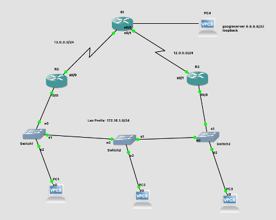
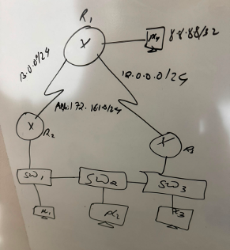
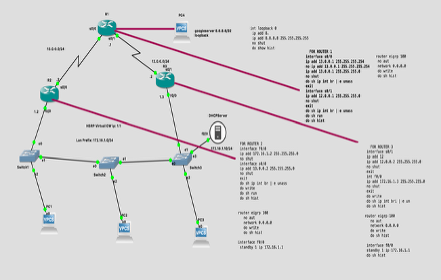

# Hot Standby Router Protocol (HSRP)

This section documents my understanding and hands-on practice with **HSRP (Hot Standby Router Protocol)**.

HSRP is a Cisco First Hop Redundancy Protocol (FHRP) used to provide **default-gateway redundancy**.

Without gateway redundancy, hosts may lose connectivity to remote networks if their configured default gateway becomes unavailable.

---

## Why HSRP Is Needed

Consider a LAN where every PC uses one router as its default gateway:

```text
PC1 ----\
PC2 ----- SW1 ----- R1 ----- Outside Networks
PC3 ----/            ^
                      |
                Default Gateway
```

If `R1` fails, the PCs may still communicate within their local subnet, but they lose their path to remote networks.

The default gateway has become a:

```text
Single Point of Failure
```

Adding a second router provides physical redundancy:

```text
                 R1
                /
PCs ----- SW1
                \
                 R2
```

However, the hosts still need **one default-gateway IP address**.

HSRP solves this by allowing the routers to present a **virtual default gateway** to the hosts.

---

## HSRP Virtual Gateway

Conceptually:

```text
               R1
             Active
               |
               |
PCs ---- SW1 --+---- Virtual Gateway
               |
               |
             Standby
               R2
```

The hosts use the **virtual IP address** as their default gateway rather than depending directly on the physical interface address of one router.

For example:

```text
R1 address:      192.168.10.2
R2 address:      192.168.10.3
HSRP virtual IP: 192.168.10.1
```

The PCs configure:

```text
Default Gateway = 192.168.10.1
```

If the Active HSRP router becomes unavailable, another HSRP router can take over responsibility for the virtual gateway.

---

## Active and Standby Routers

HSRP uses important roles including:

```text
Active Router
Standby Router
```

The **Active Router** currently forwards traffic sent to the HSRP virtual gateway.

The **Standby Router** is prepared to take over if the Active Router fails.

Conceptually:

```text
Normal Operation

PC
 |
SW1
 |
 +---- R1  ACTIVE
 |
 +---- R2  STANDBY


If R1 fails:

PC
 |
SW1
 |
 +---- R1  FAILED
 |
 +---- R2  ACTIVE
```

The objective is to maintain default-gateway availability even when one physical gateway device becomes unavailable.

---

> **Key takeaway:** HSRP separates the default gateway used by end devices from a single physical router by providing a redundant virtual gateway.


---

## HSRP Priority

When multiple routers participate in the same HSRP group, HSRP needs to determine which router should become the **Active Router**.

One important value used for this decision is:

```text
HSRP Priority
```

The default HSRP priority is:

```text
100
```

Unlike STP bridge priority, where the **lowest value wins**, HSRP prefers the:

```text
Highest Priority
```

For example:

```text
R1 Priority = 110
R2 Priority = 100

        ↓

R1 becomes Active
R2 becomes Standby
```

This is an important distinction:

```text
STP Root Bridge Election
Lowest priority preferred

HSRP Active Router Election
Highest priority preferred
```

---

## Configuring HSRP Priority

A router can be given a higher HSRP priority to make it the preferred Active Router.

For example:

```cisco
interface GigabitEthernet0/0
 standby 1 priority 110
```

Here:

```text
1   = HSRP group number
110 = HSRP priority
```

If the other router remains at the default priority of `100`, R1 has the preferred HSRP priority.

---

## What Is Preemption?

Priority alone does not necessarily mean that a preferred router will immediately take back the Active role after recovering from a failure.

This is where **preemption** becomes important.

Preemption allows a router with a higher HSRP priority to take over the Active role when it becomes available.

It can be configured with:

```cisco
standby 1 preempt
```

---

## Example Failover and Recovery

Suppose:

```text
R1 Priority = 110
R2 Priority = 100
```

Initially:

```text
R1 = Active
R2 = Standby
```

If R1 fails:

```text
R1 = Down
R2 = Active
```

R2 takes responsibility for the virtual gateway.

Later, R1 comes back online.

With preemption configured:

```text
R1 returns
    ↓
R1 has higher priority
    ↓
R1 preempts R2
    ↓
R1 = Active
R2 = Standby
```

Without preemption, the currently Active router may remain Active even after the higher-priority router returns.

---

## Priority and Preemption Together

A useful way for me to remember the difference is:

```text
Priority
   ↓
"Which router is preferred?"


Preemption
   ↓
"Can the preferred router take the Active role back?"
```

Therefore, a common configuration on the preferred router could be:

```cisco
interface GigabitEthernet0/0
 standby 1 priority 110
 standby 1 preempt
```

---

## HSRP Election Logic

My simplified HSRP decision process is:

```text
Routers join the same HSRP group
              ↓
Compare HSRP priority
              ↓
Higher priority preferred
              ↓
Active Router selected
              ↓
Standby Router waits
              ↓
Active fails → Standby takes over
              ↓
Preferred router returns
              ↓
Preemption determines whether it takes Active back
```

> **Key takeaway:** HSRP priority determines which router is preferred to become Active, while preemption allows a higher-priority router to reclaim the Active role after it becomes available again.


---

## HSRP Group Number

HSRP configuration uses a **group number** to associate routers that are providing redundancy for the same virtual gateway.

For example:

```cisco
standby 1 ip 192.168.10.1
```

Here:

```text
standby = HSRP configuration
1       = HSRP group number
192.168.10.1 = Virtual IP address
```

Routers participating in the same HSRP group must be configured consistently for that virtual gateway.

---

## Configuring the Virtual IP Address

Consider two routers:

```text
R1 Physical IP = 192.168.10.2
R2 Physical IP = 192.168.10.3

HSRP Virtual IP = 192.168.10.1
```

The end devices do not use either physical router address as their default gateway.

Instead:

```text
PC Default Gateway = 192.168.10.1
```

The virtual IP represents the redundant gateway service provided by the HSRP routers.

---

## Example Two-Router Configuration

### R1 - Preferred Active Router

```cisco
interface GigabitEthernet0/0
 ip address 192.168.10.2 255.255.255.0
 standby 1 ip 192.168.10.1
 standby 1 priority 110
 standby 1 preempt
 no shutdown
```

R1 has:

```text
Physical IP = 192.168.10.2
HSRP VIP    = 192.168.10.1
Priority    = 110
Preempt     = Enabled
```

Therefore, R1 is intended to be the preferred Active Router.

---

### R2 - Standby Router

```cisco
interface GigabitEthernet0/0
 ip address 192.168.10.3 255.255.255.0
 standby 1 ip 192.168.10.1
 standby 1 priority 100
 no shutdown
```

R2 has:

```text
Physical IP = 192.168.10.3
HSRP VIP    = 192.168.10.1
Priority    = 100
```

Under normal conditions:

```text
              192.168.10.1
              Virtual Gateway
                    |
            +-------+-------+
            |               |
           R1              R2
      192.168.10.2     192.168.10.3
       Priority 110     Priority 100
          ACTIVE          STANDBY
```

---

## What the PC Sees

The PC does not need to know which physical router is currently Active.

Its configuration remains:

```text
IP Address:      192.168.10.x
Subnet Mask:     255.255.255.0
Default Gateway: 192.168.10.1
```

If R1 fails:

```text
R1 fails
   ↓
R2 becomes Active
   ↓
192.168.10.1 remains the gateway
   ↓
PC configuration does not change
```

This separation between the **physical router addresses** and the **virtual gateway address** is the central idea behind HSRP.

---

## Complete Logic

I can now think of the configuration as four separate pieces:

```text
HSRP Group
     ↓
Which routers belong together?

Virtual IP
     ↓
Which gateway address do hosts use?

Priority
     ↓
Which router is preferred as Active?

Preemption
     ↓
Can the preferred router reclaim Active status?
```

> **Key takeaway:** The physical router interfaces keep their own unique IP addresses, while routers in the same HSRP group cooperate to provide a shared virtual IP address that hosts use as their default gateway.


---

## HSRP States

HSRP routers move through a number of states while determining their role within an HSRP group.

The important states are:

```text
Initial
Learn
Listen
Speak
Standby
Active
```

A simplified view is:

```text
Initial
   ↓
Learn
   ↓
Listen
   ↓
Speak
   ↓
Standby
   ↓
Active
```

The two states I care about most during normal operation are:

```text
Active
Standby
```

The **Active Router** currently forwards traffic for the virtual gateway.

The **Standby Router** is ready to take over if the Active Router fails.

---

## Verifying HSRP

The primary verification command is:

```cisco
show standby
```

A shorter summary can be displayed with:

```cisco
show standby brief
```

These commands allow me to verify:

```text
HSRP group number
Current state
Priority
Preemption
Active router
Standby router
Virtual IP address
```

---

## Example Verification Output

A typical summary may look like:

```text
Interface   Grp  Pri  P  State    Active           Standby          Virtual IP
Gi0/0       1    110  P  Active   local            192.168.10.3     192.168.10.1
```

This tells me:

```text
Group      = 1
Priority   = 110
Preempt    = Enabled
State      = Active
Active     = local router
Standby    = 192.168.10.3
Virtual IP = 192.168.10.1
```

On the other router, I would expect something similar to:

```text
Interface   Grp  Pri  P  State     Active           Standby   Virtual IP
Gi0/0       1    100     Standby   192.168.10.2     local     192.168.10.1
```

---

## Interpreting the Output

If the output shows:

```text
State = Active
```

that router currently owns responsibility for forwarding traffic sent to the HSRP virtual gateway.

If the output shows:

```text
State = Standby
```

that router is prepared to take over if the Active Router becomes unavailable.

The word:

```text
local
```

means the router on which I am running the command.

---

## Testing HSRP Failover

A useful lab test is to deliberately shut down the Active router interface.

For example:

```cisco
interface GigabitEthernet0/0
 shutdown
```

I can then check the second router:

```cisco
show standby brief
```

The expected result is:

```text
Standby
   ↓
Active
```

The virtual IP remains the same:

```text
192.168.10.1
```

The host therefore continues using the same default gateway.

---

## Testing Recovery and Preemption

After restoring the preferred router:

```cisco
interface GigabitEthernet0/0
 no shutdown
```

if the router has:

```cisco
standby 1 priority 110
standby 1 preempt
```

it can reclaim the Active role because it has the higher priority.

The sequence becomes:

```text
R1 Active
   ↓
R1 fails
   ↓
R2 becomes Active
   ↓
R1 returns
   ↓
R1 has higher priority + preempt
   ↓
R1 becomes Active again
```

---

> **Key takeaway:** `show standby` and `show standby brief` allow me to verify not only whether HSRP is configured, but which router is Active, which is Standby, whether preemption is enabled, and which virtual gateway is being protected.


---

# Hands-On HSRP Lab

After studying HSRP concepts, I built a redundant gateway topology in **GNS3** to test HSRP behaviour in practice.

## Lab Topology



The topology contains three routers, three switches, multiple client PCs, and redundant gateway routers connected to the same LAN.

The LAN network used in the lab is:

```text
172.16.1.0/24
The two HSRP routers use:

R2 Fa0/0: 172.16.1.2/24
R3 Fa0/0: 172.16.1.3/24
```

The shared HSRP virtual gateway is:

```text
172.16.1.1
```

Therefore, the clients use:

```text
Default Gateway: 172.16.1.1
```

rather than depending directly on either physical router address.


---

## Initial Router Addressing

Before configuring HSRP, I first configured the Layer 3 interfaces connecting the routers.

The topology uses two routed networks between R1 and the HSRP gateway routers:

```text
R1 ↔ R2 = 13.0.0.0/24
R1 ↔ R3 = 12.0.0.0/24
```

The LAN protected by HSRP is:

```text
172.16.1.0/24
```

### R1

I configured R1 with:

```cisco
interface Serial0/0
 ip address 13.0.0.1 255.255.255.0
 no shutdown

interface Serial0/1
 ip address 12.0.0.1 255.255.255.0
 no shutdown
```

I verified the interfaces using:

```cisco
show ip interface brief
```

---

### R2

R2 connects R1 to the LAN:

```cisco
interface Serial0/0
 ip address 13.0.0.2 255.255.255.0
 no shutdown

interface FastEthernet0/0
 ip address 172.16.1.2 255.255.255.0
 no shutdown
```

---

### R3

R3 provides the second gateway path:

```cisco
interface Serial0/1
 ip address 12.0.0.2 255.255.255.0
 no shutdown

interface FastEthernet0/0
 ip address 172.16.1.3 255.255.255.0
 no shutdown
```

At this stage, R2 and R3 each had their own physical LAN address:

```text
R2 = 172.16.1.2
R3 = 172.16.1.3
```

HSRP would later allow them to provide the shared virtual gateway:

```text
172.16.1.1
```

---

## Why I Configured HSRP on Fa0/0

HSRP was configured on the interfaces facing the **LAN**, not on the serial interfaces facing R1.

In my topology:

```text
             R1
           /    \
          /      \
        R2        R3
        |         |
      Fa0/0     Fa0/0
        \         /
         \       /
        172.16.1.0/24
              |
            Hosts
```

The hosts need redundant **first-hop/default-gateway connectivity**, so the HSRP virtual gateway belongs on the LAN-facing interfaces.

> **Lab lesson:** Before configuring HSRP, I first established the physical Layer 3 addressing. R2 and R3 retained unique physical addresses while later sharing one HSRP virtual gateway for the LAN.

---

## Configuring HSRP on R2 and R3

With the physical interface addressing in place, I configured HSRP on the LAN-facing `FastEthernet0/0` interfaces of R2 and R3.

Both routers participate in:

```text
HSRP Group: 1
Virtual IP: 172.16.1.1
```

The clients can therefore use `172.16.1.1` as their default gateway instead of depending on one physical router.

---

### R2 HSRP Configuration

On R2:

```cisco
interface FastEthernet0/0
 standby 1 ip 172.16.1.1
```

I then verified HSRP using:

```cisco
show standby brief
```

My lab output showed:

```text
Interface   Grp  Pri  P  State   Active          Standby         Virtual IP
Fa0/0       1    100     Active  local           172.16.1.3      172.16.1.1
```

This tells me:

```text
Interface  = Fa0/0
Group      = 1
Priority   = 100
State      = Active
Active     = local
Standby    = 172.16.1.3
Virtual IP = 172.16.1.1
```

Therefore, at this point in the lab:

```text
R2 = Active
R3 = Standby
```

---

### R3 HSRP Configuration

On R3:

```cisco
interface FastEthernet0/0
 standby 1 ip 172.16.1.1
```

Verification on R3 showed:

```text
Interface   Grp  Pri  P  State     Active          Standby   Virtual IP
Fa0/0       1    100     Standby   172.16.1.2      local     172.16.1.1
```

From R3's perspective:

```text
Priority   = 100
State      = Standby
Active     = 172.16.1.2
Standby    = local
Virtual IP = 172.16.1.1
```

The two routers therefore agreed on their HSRP roles:

```text
                    172.16.1.1
                 HSRP Virtual IP
                       |
              +--------+--------+
              |                 |
             R2                R3
        172.16.1.2         172.16.1.3
             |                 |
          ACTIVE            STANDBY
```

---

## What `local` Means

The word:

```text
local
```

in `show standby brief` refers to the router on which I am currently running the command.

Therefore, on R2:

```text
Active = local
```

means R2 itself is the Active Router.

On R3:

```text
Standby = local
```

means R3 itself is the Standby Router.

---

## Why R2 Became Active

At this stage, both routers were using the default HSRP priority:

```text
R2 Priority = 100
R3 Priority = 100
```

When HSRP priorities are equal, the router with the higher interface IP address is used as an election tie-breaker.

However, HSRP election behaviour can also depend on which router became Active first and whether preemption is configured.

Later in the lab, I deliberately manipulated **priority and preemption** to control which router held the Active role.

> **Lab observation:** `show standby brief` allowed me to verify the HSRP relationship from both routers. R2 reported itself as Active while R3 independently reported itself as Standby, with both sharing the same virtual gateway `172.16.1.1`.

---

## Integrating DHCP with the HSRP Virtual Gateway

After configuring HSRP, I configured DHCP so that client devices would automatically receive their network settings.

An important part of this configuration was ensuring that clients received the **HSRP virtual IP address** as their default gateway.

My DHCP pool was configured as:

```cisco
ip dhcp pool HSRP_POOL
 network 172.16.1.0 255.255.255.0
 dns-server 8.8.8.8
 default-router 172.16.1.1
 domain-name hsrpmastrt.com
```

The most important line for HSRP was:

```cisco
default-router 172.16.1.1
```

Instead of providing:

```text
172.16.1.2  → R2 physical address
```

or:

```text
172.16.1.3  → R3 physical address
```

DHCP provides:

```text
172.16.1.1  → HSRP Virtual IP
```

Therefore, the clients are not tied to one physical gateway router.

---

## Excluding Infrastructure Addresses

I also excluded addresses that should not be dynamically assigned to clients:

```cisco
ip dhcp excluded-address 172.16.1.1
ip dhcp excluded-address 172.16.1.2
ip dhcp excluded-address 172.16.1.3
ip dhcp excluded-address 172.16.1.10
```

These addresses were reserved for infrastructure purposes.

In particular:

```text
172.16.1.1 → HSRP Virtual IP
172.16.1.2 → R2
172.16.1.3 → R3
```

This prevents DHCP from accidentally assigning an infrastructure address to a client.

---

## Client Verification

I then configured PC1 to obtain its addressing through DHCP.

From the client:

```text
PC1> dhcp
```

The client received:

```text
IP Address:      172.16.1.4/24
Default Gateway: 172.16.1.1
```

I then tested the gateway:

```text
PC1> ping 172.16.1.1
```

This was an important verification point because the client was communicating with the **HSRP virtual gateway**, not directly using R2 or R3 as its configured gateway.

---

## How DHCP and HSRP Work Together

The design can be visualised as:

```text
                 DHCP
                  |
                  | gives client
                  v
        Default Gateway 172.16.1.1
                  |
                  v
          HSRP Virtual Gateway
             /           \
            /             \
   172.16.1.2           172.16.1.3
       R2                   R3
     Active               Standby
```

The client configuration remains:

```text
Default Gateway = 172.16.1.1
```

even if the physical router responsible for that virtual gateway changes.

That is the real benefit of combining DHCP with first-hop redundancy: clients can receive the redundant gateway automatically without needing to know which physical router is currently Active.

> **Lab observation:** PC1 successfully received `172.16.1.4/24` through DHCP with `172.16.1.1` as its default gateway, demonstrating that the HSRP virtual IP could be distributed directly to clients as their first hop.


---

## Testing HSRP Failover

After verifying that R2 was Active and R3 was Standby, I tested what would happen if the Active gateway became unavailable.

This is the core purpose of HSRP:

```text
Active Router Fails
        ↓
Standby Router Detects Failure
        ↓
Standby Becomes Active
        ↓
Virtual IP Remains Available
```

The clients continue using:

```text
Default Gateway = 172.16.1.1
```

They do not need to change their default-gateway configuration simply because responsibility for the virtual gateway moves between routers.

---

## Simulating a Failure

During the lab, I used interface shutdown and recovery commands while observing HSRP:

```cisco
interface FastEthernet0/0
 shutdown
```

and later:

```cisco
no shutdown
```

I repeatedly checked the HSRP state using:

```cisco
show standby brief
```

This allowed me to observe changes between:

```text
Active
   ↕
Standby
```

rather than simply assuming failover had occurred.

---

## Understanding Preemption

After experimenting with failover, I configured:

```cisco
standby 1 preempt
```

Preemption becomes important when the preferred router returns after a failure.

Consider:

```text
R2 = Preferred Active
R3 = Standby

        ↓

R2 fails

        ↓

R3 becomes Active

        ↓

R2 returns
```

Without the appropriate preemption behaviour, the currently Active router may continue holding the Active role.

With preemption configured, a router with a higher HSRP priority can reclaim the Active role when it becomes available again.

A useful way for me to remember this is:

```text
Priority
   ↓
Which router is preferred?

Preempt
   ↓
Can the preferred router take Active back?
```

---

## Manipulating HSRP Priority

The default HSRP priority in my lab was:

```text
100
```

I experimented with changing the priority using commands such as:

```cisco
standby 1 priority 101
```

and:

```cisco
standby 1 priority 99
```

This allowed me to observe how HSRP preference could be deliberately changed.

The fundamental rule is:

```text
Higher HSRP Priority = More Preferred
```

For example:

```text
Router A = Priority 101
Router B = Priority 100

        ↓

Router A is preferred
```

Changing the priority therefore gives me administrative control over which router I want to prefer as the Active gateway.

---

## Tuning HSRP Timers

I also experimented with HSRP timers:

```cisco
standby 1 timers 1 3
```

In this configuration:

```text
Hello Timer = 1 second
Hold Timer  = 3 seconds
```

The hello timer controls how frequently HSRP hello messages are sent.

The hold timer determines how long a router can wait without receiving the expected HSRP communication before considering its peer unavailable.

Conceptually:

```text
HSRP Hello Messages
        ↓
Peer is reachable
        ↓
Hello messages stop
        ↓
Hold time expires
        ↓
Failure recognised
        ↓
HSRP role transition
```

Reducing these timers can allow HSRP to detect certain failures more quickly, although timer changes should be planned carefully and configured consistently between HSRP peers.

---

## Failure Detection vs Convergence

This experiment also helped me distinguish two related concepts.

```text
Failure Detection
       ↓
The network notices that something has failed.

Convergence
       ↓
The network adapts to the change and reaches a new stable state.
```

For HSRP:

```text
Active gateway fails
        ↓
Failure is detected
        ↓
Standby changes role
        ↓
New Active gateway established
        ↓
HSRP reaches a stable state
```

---

## My HSRP Testing Workflow

The practical workflow became:

```text
Verify Active / Standby
          ↓
Simulate interface failure
          ↓
Run show standby brief
          ↓
Observe role transition
          ↓
Restore the interface
          ↓
Configure preemption
          ↓
Manipulate priority
          ↓
Experiment with timers
          ↓
Verify again
```

> **Lab lesson:** HSRP became much clearer when I deliberately caused state changes instead of only configuring the protocol. By shutting and restoring interfaces, enabling preemption, changing priority, and experimenting with timers, I could observe how gateway redundancy responds to network changes.

---

# Lab Evidence and Planning

In addition to documenting the final configuration, I kept visual evidence of how I planned and implemented the HSRP lab.

## Whiteboard Planning

Before and during the lab, I used handwritten notes to map the topology, addressing, HSRP behaviour, and configuration ideas.



The whiteboard represents the planning stage of the lab rather than polished final documentation.

This is useful because network implementation often begins with:

```text
Understand the requirement
        ↓
Sketch the topology
        ↓
Plan addressing
        ↓
Identify redundancy points
        ↓
Configure
        ↓
Verify
        ↓
Troubleshoot
```

For this lab, the central design requirement was to avoid depending on a single physical default gateway.

---

## GNS3 Configuration Evidence

I also captured the GNS3 topology while working through the router configuration and verification commands.



This screenshot preserves the practical implementation environment alongside my working command notes.

The lab involved more than configuring the HSRP virtual IP. I first had to establish the surrounding network:

```text
Router Interface Addressing
          ↓
Routing Between Networks
          ↓
LAN Connectivity
          ↓
HSRP Virtual Gateway
          ↓
DHCP Client Configuration
          ↓
Failover Testing
```

This reinforced an important lesson: a redundancy protocol cannot compensate for an incorrectly configured underlying network.

---

## Commands Used During the Lab

Some of the commands I repeatedly used for configuration and troubleshooting included:

```cisco
show ip interface brief
show ip route
show running-config
show history
show standby
show standby brief
```

For HSRP specifically, `show standby brief` became one of the most useful verification commands because it provided a concise view of:

```text
Interface
HSRP Group
Priority
Preemption
State
Active Router
Standby Router
Virtual IP
```

---

## Configuration vs Verification

One of the strongest lessons from this lab was the difference between entering a command and proving that the network is operating correctly.

```text
Configuration
     ↓
What I told the router to do

Verification
     ↓
What the router is actually doing
```

For example:

```cisco
standby 1 ip 172.16.1.1
```

configures the virtual gateway.

But:

```cisco
show standby brief
```

allows me to verify the operational HSRP state.

Similarly:

```cisco
standby 1 priority 101
```

changes the configured preference, while verification allows me to observe whether the expected Active/Standby relationship actually resulted.

> **Lab evidence:** The topology screenshots, handwritten planning, configuration history, and verification output together document not only the final HSRP configuration, but the process I used to build and test it.

---

# Final Lab Reflection

This HSRP lab helped me move from understanding gateway redundancy conceptually to implementing and testing it in a working GNS3 topology.

The complete workflow was:

```text
Design the topology
        ↓
Plan IP addressing
        ↓
Configure router interfaces
        ↓
Establish routing
        ↓
Configure HSRP virtual gateway
        ↓
Verify Active and Standby routers
        ↓
Configure DHCP
        ↓
Give clients the HSRP VIP as their gateway
        ↓
Test client connectivity
        ↓
Simulate gateway failure
        ↓
Observe HSRP failover
        ↓
Configure preemption
        ↓
Manipulate HSRP priority
        ↓
Experiment with HSRP timers
        ↓
Verify the resulting state
```

---

## Key Skills Practised

Through this lab, I practised:

- First Hop Redundancy Protocol concepts
- HSRP Active and Standby roles
- HSRP virtual IP configuration
- HSRP group configuration
- Priority-based gateway preference
- HSRP preemption
- HSRP hello and hold timers
- Interface failure simulation
- Failover and recovery testing
- DHCP integration with a virtual gateway
- Router interface configuration
- Routing verification
- GNS3 network implementation
- Cisco IOS troubleshooting and verification

---

## The Most Important Concept

The most important idea I learned is that the hosts do not need to know which physical router is currently forwarding their traffic.

The clients simply use:

```text
Default Gateway = 172.16.1.1
```

Behind that virtual gateway:

```text
              172.16.1.1
             Virtual Gateway
                   |
          +--------+--------+
          |                 |
         R2                R3
    172.16.1.2        172.16.1.3
      Active             Standby
```

If the Active router becomes unavailable, HSRP can move responsibility for the virtual gateway to the Standby router while the hosts continue using the same default-gateway address.

---

## Troubleshooting Mindset

This lab also reinforced a troubleshooting workflow that I can reuse in other networking technologies:

```text
Configure
    ↓
Verify
    ↓
Test
    ↓
Introduce a failure
    ↓
Observe behaviour
    ↓
Troubleshoot
    ↓
Verify recovery
```

Rather than assuming that a command worked, I used operational commands such as:

```cisco
show standby brief
show ip interface brief
show ip route
show running-config
```

to inspect what the routers were actually doing.

---

## HSRP in One Sentence

> **HSRP provides first-hop redundancy by allowing multiple routers to present a shared virtual default gateway while one router operates as Active and another is available to take over.**

---

## Final Takeaway

Before this lab, HSRP could be described simply as:

```text
Active Router + Standby Router
```

After implementing it, I understand it more practically as:

```text
Redundant physical gateways
          +
Shared virtual gateway
          +
Active/Standby election
          +
Failure detection
          +
Automatic failover
          +
Priority and preemption
          +
Operational verification
          =
Resilient first-hop connectivity
```

The biggest lesson was not simply learning the HSRP commands. It was understanding **why the virtual gateway exists, how the routers coordinate behind it, and how to verify that redundancy actually works during a failure.**


