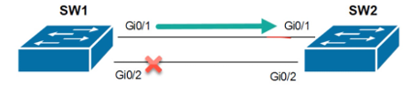
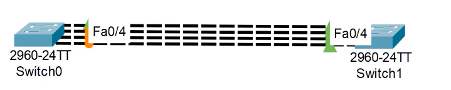
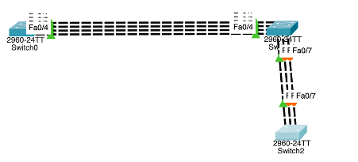
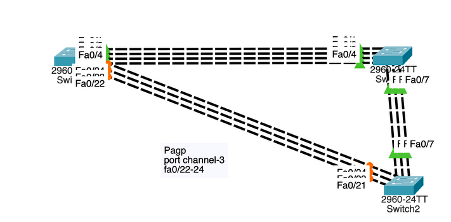

# EtherChannel, LACP & PAgP

This section documents my study and hands-on practice with **EtherChannel**, including static EtherChannel, LACP, and PAgP.

EtherChannel allows multiple physical Ethernet links to be bundled together and treated as a **single logical link**.

## Topics Covered

- Why EtherChannel is needed
- Relationship between STP and EtherChannel
- Physical links vs logical Port-Channel
- Layer 2 EtherChannel
- Layer 3 EtherChannel concepts
- EtherChannel configuration requirements
- Static EtherChannel (`mode on`)
- Dynamic EtherChannel
- LACP
- PAgP
- Active and Passive modes
- Desirable and Auto modes
- EtherChannel load balancing
- Port-Channel verification
- Hands-on Packet Tracer configuration

---

## Why EtherChannel Is Needed

When multiple physical Layer 2 links are connected between two switches, STP protects the network from switching loops.

Without EtherChannel, STP may place redundant links into a blocking/discarding state:

```text
       Link 1 → Forwarding
SW1 ======================= SW2
SW1 ----------------------- SW2
       Link 2 → Blocked by STP
```

This prevents a Layer 2 loop, but it also means that the available physical links are not all being used as independent forwarding paths.

EtherChannel provides a different approach by bundling compatible physical links into **one logical interface**:

```text
        Physical Link 1
        Physical Link 2
SW1     Physical Link 3      SW2
        Physical Link 4
             ↓
        EtherChannel
             ↓
      Logical Port-Channel
```

From STP's perspective, the EtherChannel is treated as a single logical link rather than several independent parallel links.

This allows the design to gain benefits such as:

- Increased aggregate bandwidth
- Link redundancy
- Traffic load distribution
- Use of multiple physical links as one logical connection
- Simpler logical interface management

> **Key idea:** EtherChannel does not remove STP. Instead, STP sees the bundled EtherChannel as a single logical interface while EtherChannel manages the member physical links.

### Before EtherChannel: STP Blocking a Redundant Link



This topology shows the problem before EtherChannel was configured. Multiple physical links existed between the switches, but STP blocked a redundant path to prevent a Layer 2 loop.

---

## Layer 2 vs Layer 3 EtherChannel

EtherChannel can operate as either a **Layer 2 logical link** or a **Layer 3 logical link**.

The main difference is whether the Port-Channel performs **switching** or **routing**.

---

### Layer 2 EtherChannel

A Layer 2 EtherChannel combines multiple physical switch ports into a single logical **Layer 2 Port-Channel**.

It operates as a switchport and carries Ethernet frames and VLAN traffic.

```text
        Layer 2 EtherChannel

     Fa0/1 ───────── Fa0/1
     Fa0/2 ───────── Fa0/2
SW1  Fa0/3 ───────── Fa0/3  SW2
     Fa0/4 ───────── Fa0/4
          \          /
           \        /
          Port-Channel
```

The logical Port-Channel can operate as an:

```text
Access Port
     or
Trunk Port
```

For example, in a trunk-based EtherChannel:

```cisco
interface range fa0/1-4
 switchport mode trunk
 channel-group 1 mode on
```

The physical interfaces become members of the same channel group.

The resulting logical interface is:

```text
Port-Channel1
```

Because this is a Layer 2 EtherChannel, the Port-Channel performs switching rather than Layer 3 routing.

---

### Layer 3 EtherChannel

A Layer 3 EtherChannel also combines multiple physical Ethernet links into one logical Port-Channel, but the resulting interface operates as a **routed interface**.

Conceptually:

```text
          Layer 3 EtherChannel

       Physical Links
     =================
L3 SW1                L3 SW2
     =================
            ↓
      Logical Routed
       Port-Channel
```

The important distinction is:

```text
Layer 2 EtherChannel
        ↓
Switching
VLAN / Trunk traffic

Layer 3 EtherChannel
        ↓
Routing
Layer 3 connectivity
```

---

## Layer 2 vs Layer 3 Summary

| Feature | Layer 2 EtherChannel | Layer 3 EtherChannel |
|---|---|---|
| Operation | Switching | Routing |
| Logical interface | Port-Channel | Port-Channel |
| Carries VLAN traffic | Yes | Not as a Layer 2 trunk |
| Can operate as a trunk | Yes | No |
| Layer 3 addressing | Not used for the Layer 2 Port-Channel | Applied to the routed Port-Channel |
| Typical purpose | Aggregate switched links | Aggregate routed links |

In my current hands-on lab, most of my practical EtherChannel configuration focused on **Layer 2 EtherChannel**, including trunk links, static EtherChannel, LACP, and PAgP.

I also began studying the concept of Layer 3 EtherChannel, but I have not yet documented a complete Layer 3 EtherChannel configuration lab.

> **Key takeaway:** Both types bundle multiple physical links into one logical Port-Channel. The difference is whether that logical interface operates at Layer 2 for switching or at Layer 3 for routing.


---

## EtherChannel Formation Requirements

Before multiple physical interfaces can successfully operate as one EtherChannel, their configurations need to be compatible.

An EtherChannel should not be thought of as a way of combining randomly configured interfaces. The member links need consistent Layer 2 characteristics.

In my study, I identified several important settings that need to match.

### Speed

Member interfaces should operate at compatible speeds.

```text
Fa0/1 → 100 Mbps
Fa0/2 → 100 Mbps
Fa0/3 → 100 Mbps
Fa0/4 → 100 Mbps
```

The physical links forming the bundle should have consistent interface characteristics.

---

### Duplex

The duplex settings should also match.

```text
Fa0/1 → Full Duplex
Fa0/2 → Full Duplex
Fa0/3 → Full Duplex
Fa0/4 → Full Duplex
```

A mismatch in physical interface configuration can prevent the links from operating together correctly.

---

### Layer 2 Mode

For a Layer 2 EtherChannel, the participating interfaces need compatible switchport configurations.

For example, in my trunk EtherChannel lab I configured:

```cisco
interface range fa0/1-4
 switchport mode trunk
 channel-group 1 mode on
```

This means the four physical interfaces participate in the same logical Layer 2 connection.

---

### Trunk Configuration

When the EtherChannel is being used as a trunk, trunk-related settings should be consistent.

Important settings include:

```text
Trunk mode
Trunk encapsulation
Allowed VLAN list
Native VLAN
```

Conceptually, I should avoid a situation such as:

```text
SW1                          SW2

Allowed VLANs: 10,20         Allowed VLANs: 10,30
Native VLAN: 10              Native VLAN: 20

              MISMATCH
```

Instead, the EtherChannel should be designed with compatible trunk settings on both sides.

---

## Why Consistency Matters

The physical interfaces eventually operate as members of one logical interface:

```text
Fa0/1 ─┐
Fa0/2 ─┤
Fa0/3 ─┼──→ Port-Channel1
Fa0/4 ─┘
```

Therefore, their configurations should describe the same intended logical connection.

A useful way for me to think about this is:

```text
Compatible Physical Interfaces
             ↓
      Channel Group
             ↓
       Port-Channel
             ↓
    One Logical Interface
```

---

## Configuration Checklist

Before troubleshooting an EtherChannel that is not forming correctly, I can check:

```text
[ ] Interface speed
[ ] Duplex
[ ] Layer 2 mode
[ ] Trunk configuration
[ ] Allowed VLANs
[ ] Native VLAN
[ ] Channel-group configuration
```

These checks can help identify configuration inconsistencies before troubleshooting deeper EtherChannel behaviour.

> **Key takeaway:** EtherChannel combines multiple physical interfaces into one logical connection, so the member links must have compatible configurations for the bundle to operate correctly.


Before EtherChannel
      ↓
Multiple physical links
      ↓
STP blocks redundant paths
      ↓
Configure Fa0/1-4
      ↓
channel-group 1 mode on
      ↓
Port-Channel1 created
      ↓
Verify with show etherchannel summary


---

# Hands-On Static EtherChannel Lab

After studying the EtherChannel requirements, I implemented a **Layer 2 static EtherChannel** in my Packet Tracer topology.

The goal was to bundle multiple physical links between switches into a single logical Port-Channel.

---

## Before EtherChannel

Before creating the EtherChannel, the switches had multiple physical Layer 2 connections between them.

STP detected the redundant paths.

On the Root Bridge, my output showed the interfaces as Designated and Forwarding:

```text
Fa0/3  Desg  FWD  19
Fa0/4  Desg  FWD  19
Fa0/1  Desg  FWD  19
Fa0/2  Desg  FWD  19
```

On the neighbouring switch, I observed:

```text
Fa0/1  Root  FWD  19
Fa0/2  Altn  BLK  19
Fa0/3  Altn  BLK  19
Fa0/4  Altn  BLK  19
```

This demonstrated the problem I was trying to solve:

```text
Multiple Physical Links
          ↓
STP Detects Redundancy
          ↓
One Path Forwards
          ↓
Other Redundant Paths Block
```

The physical links existed, but STP could not simply allow all of them to forward independently because that would create a Layer 2 loop.

---

## Creating the Static EtherChannel

I selected four physical interfaces:

```text
Fa0/1
Fa0/2
Fa0/3
Fa0/4
```

### Static EtherChannel Topology



This Packet Tracer topology shows the four physical FastEthernet links used in my static EtherChannel experiment.

The interfaces were bundled into a single logical Port-Channel using Channel Group 1.


Instead of configuring each interface individually, I used an interface range:

```cisco
interface range fa0/1-4
 switchport mode trunk
 channel-group 1 mode on
 no shutdown
```

The important command was:

```cisco
channel-group 1 mode on
```

This assigned the interfaces to:

```text
Channel Group 1
```

and created the logical:

```text
Port-Channel1
```

---

## Understanding `mode on`

The keyword:

```text
on
```

creates a **static EtherChannel**.

In this mode, the switch does not use LACP or PAgP to negotiate the EtherChannel.

Conceptually:

```text
SW1                         SW2

Fa0/1 ===================== Fa0/1
Fa0/2 ===================== Fa0/2
Fa0/3 ===================== Fa0/3
Fa0/4 ===================== Fa0/4
       \                   /
        \                 /
          Port-Channel1
          Static Mode ON
```

Because there is no negotiation protocol protecting against a configuration mismatch, the EtherChannel configuration needs to be intentionally compatible on both sides.

In my lab, I configured the other switch with the corresponding interfaces:

```cisco
interface range fa0/1-4
 switchport mode trunk
 channel-group 1 mode on
 no shutdown
```

---

## Configuring the Logical Port-Channel

The resulting logical interface was:

```cisco
interface port-channel 1
```

For the Layer 2 lab, the Port-Channel operated as a trunk.

Where required by the platform/configuration, the logical interface can be checked to ensure that its trunk configuration is consistent with the intended design.

The important relationship is:

```text
Physical Interfaces
Fa0/1
Fa0/2
Fa0/3
Fa0/4
   ↓
Channel Group 1
   ↓
Port-Channel1
   ↓
Logical Trunk
```

---

## Verifying the EtherChannel

After creating the bundle, I used several commands to verify the configuration.

### EtherChannel Summary

```cisco
show etherchannel summary
```

This is one of the most useful commands for checking whether the Port-Channel and its member interfaces have formed correctly.

### Trunk Verification

```cisco
show interfaces trunk
```

This allows me to verify the trunking state of the Layer 2 connection.

### Physical Interface Verification

I also checked an individual member interface:

```cisco
show interfaces fa0/1
```

Together, these commands help me verify both the **logical EtherChannel** and the **physical interfaces participating in it**.

---

## What Changed After Bundling the Links

Before EtherChannel:

```text
Fa0/1 ──────────────── Fa0/1
Fa0/2 ───── STP ───── Fa0/2
Fa0/3 ───── STP ───── Fa0/3
Fa0/4 ───── STP ───── Fa0/4

Four independent Layer 2 links
```

After EtherChannel:

```text
Fa0/1 ─┐             ┌─ Fa0/1
Fa0/2 ─┤             ├─ Fa0/2
Fa0/3 ─┼─ Port-Channel ┼─ Fa0/3
Fa0/4 ─┘             └─ Fa0/4

      One logical connection
```

STP can treat the Port-Channel as a **single logical interface** rather than treating each member link as an independent parallel Layer 2 path.

---

## Static EtherChannel Limitation

An important lesson from `mode on` is that it does not negotiate the channel.

```text
mode on
   ↓
No LACP
No PAgP
   ↓
Static EtherChannel
```

This makes correct configuration on both ends especially important.

Later in the lab, I moved from static EtherChannel to **dynamic EtherChannel using LACP and PAgP**, where negotiation modes determine whether the channel can form.

> **Lab lesson:** By bundling `Fa0/1-4` into `Port-Channel1`, I changed four independent physical Layer 2 links into one logical EtherChannel. This allowed me to see directly how EtherChannel and STP work together rather than treating them as unrelated technologies.


---

# Dynamic EtherChannel

After configuring EtherChannel using static `mode on`, I moved to **Dynamic EtherChannel**.

Unlike static EtherChannel, dynamic EtherChannel uses a negotiation protocol between switches to help form the Port-Channel.

The two protocols I studied are:

```text
Dynamic EtherChannel
        |
        +-- LACP
        |    +-- Active
        |    +-- Passive
        |
        +-- PAgP
             +-- Desirable
             +-- Auto
```
### Expanded EtherChannel Topology



I expanded the original two-switch EtherChannel topology by adding another switch and additional bundled links.

This allowed me to move beyond a single Port-Channel and explore how EtherChannel can be used across a larger switched topology.---

## LACP

**LACP (Link Aggregation Control Protocol)** uses negotiation between devices to form an EtherChannel.

The two LACP modes are:

```text
Active
Passive
```

### Active Mode

`active` actively attempts to negotiate and form an LACP EtherChannel with the neighbouring device.

Example:

```cisco
interface range fa0/1-4
 switchport mode trunk
 channel-group 1 mode active
```

### Passive Mode

`passive` participates in LACP but waits for the other side to initiate negotiation.

Example:

```cisco
interface range fa0/1-4
 switchport mode trunk
 channel-group 1 mode passive
```

### LACP Mode Combinations

The important combinations are:

| Side A | Side B | EtherChannel Forms? |
|---|---|---|
| Active | Active | Yes |
| Active | Passive | Yes |
| Passive | Active | Yes |
| Passive | Passive | No |

The key rule is:

```text
At least one side must be Active.
```

So:

```text
Active  + Active   = Forms
Active  + Passive  = Forms
Passive + Passive  = Does Not Form
```

---

## PAgP

**PAgP (Port Aggregation Protocol)** is Cisco's EtherChannel negotiation protocol.

The two PAgP modes I studied are:

```text
Desirable
Auto
```

### Desirable Mode

`desirable` actively attempts to negotiate a PAgP EtherChannel.

Example:

```cisco
interface range fa0/22-24
 switchport mode trunk
 channel-protocol pagp
 channel-group 3 mode desirable
```

### Auto Mode

`auto` waits for the neighbouring device to initiate PAgP negotiation.

Example:

```cisco
interface range fa0/21,fa0/23-24
 switchport mode trunk
 channel-protocol pagp
 channel-group 3 mode auto
```

### PAgP Mode Combinations

| Side A | Side B | EtherChannel Forms? |
|---|---|---|
| Desirable | Desirable | Yes |
| Desirable | Auto | Yes |
| Auto | Desirable | Yes |
| Auto | Auto | No |

The key rule is:

```text
At least one side must be Desirable.
```

So:

```text
Desirable + Desirable = Forms
Desirable + Auto      = Forms
Auto      + Auto      = Does Not Form
```

---

## LACP vs PAgP

The negotiation logic is similar, but the protocols and mode names are different.

| Feature | LACP | PAgP |
|---|---|---|
| Negotiation | Dynamic | Dynamic |
| Active negotiation mode | Active | Desirable |
| Waiting mode | Passive | Auto |
| Both waiting modes form? | No | No |

A useful way for me to remember the relationship is:

```text
LACP
Active    = Initiates
Passive   = Waits

PAgP
Desirable = Initiates
Auto      = Waits
```

---

## Protocols Cannot Be Mixed

LACP and PAgP are different EtherChannel negotiation protocols.

Therefore, I should not configure:

```text
SW1                         SW2

LACP                        PAgP
Active  <--------------->   Desirable

             X
```

Instead, both sides need to use the same negotiation protocol with compatible modes.

For example:

```text
LACP:

SW1 Active <----------> SW2 Passive
                 ✓
```

or:

```text
PAgP:

SW1 Desirable <-------> SW2 Auto
                 ✓
```

---

## Static vs Dynamic EtherChannel

I can now distinguish the three approaches I studied:

| Method | Modes | Negotiation |
|---|---|---|
| Static EtherChannel | `on` | None |
| LACP | `active` / `passive` | LACP |
| PAgP | `desirable` / `auto` | PAgP |

Conceptually:

```text
EtherChannel
     |
     +-- Static
     |     |
     |     +-- mode on
     |
     +-- Dynamic
           |
           +-- LACP
           |    +-- active
           |    +-- passive
           |
           +-- PAgP
                +-- desirable
                +-- auto
```

> **Key takeaway:** Static `mode on` forces the EtherChannel without a negotiation protocol, while LACP and PAgP dynamically negotiate the bundle using compatible modes on each side.


---

# Hands-On PAgP EtherChannel Lab

After studying the differences between static EtherChannel, LACP, and PAgP, I implemented a **dynamic EtherChannel using PAgP**.

The objective was to allow the switches to negotiate the EtherChannel rather than forcing the bundle using static `mode on`.

For this part of the lab, I used:

```text
Protocol      = PAgP
Channel Group = 3
Modes         = Desirable / Auto
```

---
### PAgP Lab Topology



This Packet Tracer topology shows my dynamic PAgP EtherChannel experiment using **Channel Group 3**.

The lab allowed me to test how `desirable` and `auto` modes negotiate the formation of a logical Port-Channel instead of forcing the bundle with static `mode on`.

## Configuring the Desirable Side

On one side of the EtherChannel, I configured the interfaces to use PAgP in `desirable` mode.

My configuration included:

```cisco
interface range fa0/22-24
 switchport mode trunk
 switchport nonegotiate
 no shutdown
 channel-protocol pagp
 channel-group 3 mode desirable
 no shutdown
```

The important commands were:

```cisco
channel-protocol pagp
channel-group 3 mode desirable
```

`desirable` means that this side actively attempts to negotiate the PAgP EtherChannel.

Conceptually:

```text
Switch
  |
Fa0/22 ─┐
Fa0/23 ─┼── Channel Group 3
Fa0/24 ─┘
             |
             ↓
        Port-Channel3
```

---

## Configuring the Auto Side

On the neighbouring switch, I configured the corresponding interfaces to participate in the same PAgP EtherChannel using `auto`.

My lab notes included:

```cisco
interface range fa0/21,fa0/23-24
 switchport mode trunk
 switchport nonegotiate
 no shutdown
 channel-protocol pagp
 channel-group 3 mode auto
 no shutdown
```

Here:

```text
Desirable = actively negotiates
Auto      = waits for PAgP negotiation
```

Therefore:

```text
       PAgP Negotiation

SW1                         SW2

Desirable  <------------->  Auto
    |                         |
Fa0/22-24                 Member Ports
    \                         /
     \                       /
          Port-Channel3

                ✓
       EtherChannel can form
```

---

## Why Desirable + Auto Works

The two modes behave differently:

```text
Desirable
    ↓
Actively sends PAgP negotiation

Auto
    ↓
Responds to PAgP negotiation
```

Therefore:

```text
Desirable + Auto = Compatible
```

However:

```text
Auto + Auto
```

would leave both sides waiting for the other side to initiate negotiation.

That combination does not dynamically form the PAgP EtherChannel.

---

## Static EtherChannel vs My PAgP Lab

Earlier, I configured:

```cisco
channel-group 1 mode on
```

That created a static EtherChannel without LACP or PAgP negotiation.

In this experiment, I instead used:

```cisco
channel-protocol pagp
channel-group 3 mode desirable
```

and on the other side:

```cisco
channel-protocol pagp
channel-group 3 mode auto
```

This gave me a practical comparison:

```text
Static EtherChannel
        |
        +-- mode on
        |
        +-- No negotiation


Dynamic PAgP EtherChannel
        |
        +-- desirable
        +-- auto
        |
        +-- PAgP negotiation
```

---

## Verifying the Dynamic EtherChannel

After configuring both sides, the EtherChannel should be verified rather than assuming that the bundle formed successfully.

Useful commands include:

```cisco
show etherchannel summary
```

and:

```cisco
show interfaces trunk
```

I can also inspect the logical Port-Channel and individual member interfaces when troubleshooting.

The verification process is:

```text
Configure Member Interfaces
          ↓
Configure PAgP
          ↓
Assign Channel Group
          ↓
Check Port-Channel
          ↓
Check Member Interfaces
          ↓
Verify Trunk Operation
```

---

## What I Learned From the PAgP Lab

This experiment helped me understand that EtherChannel is more than simply grouping several cables together.

There are three separate concepts involved:

```text
Physical Interfaces
        ↓
Channel Group
        ↓
Logical Port-Channel
```

The negotiation protocol determines **how the switches agree to form that logical bundle**.

In this lab:

```text
Protocol      = PAgP
Active Side   = Desirable
Waiting Side  = Auto
Channel Group = 3
Logical Link  = Port-Channel3
```

> **Lab lesson:** Static `mode on` taught me how physical interfaces are manually bundled, while the PAgP experiment demonstrated how compatible negotiation modes can dynamically establish an EtherChannel between switches.


---

# EtherChannel Load Balancing

EtherChannel combines multiple physical links into one logical Port-Channel, but traffic still needs to be distributed across the individual member links.

EtherChannel uses a **load-balancing algorithm** to decide which physical member link should carry particular traffic.

The load-balancing methods I studied include:

```text
Source MAC Address
Destination MAC Address
Source + Destination MAC Address

Source IP Address
Destination IP Address
Source + Destination IP Address

Source Port Number
Destination Port Number
Source + Destination Port Number
```

---

## How Load Balancing Works

Consider an EtherChannel containing four physical links:

```text
                 Port-Channel1

SW1                                      SW2
 |                                        |
 +------ Fa0/1 ================= Fa0/1 ---+
 +------ Fa0/2 ================= Fa0/2 ---+
 +------ Fa0/3 ================= Fa0/3 ---+
 +------ Fa0/4 ================= Fa0/4 ---+
```

Logically, STP and the switches can treat this as one Port-Channel.

Physically, however, traffic must still travel over one of the member links.

Conceptually:

```text
Traffic
   ↓
EtherChannel Load-Balancing Algorithm
   ↓
Hash Calculation
   ↓
Selected Physical Member Link
```

This allows different traffic flows to be distributed across the available links.

---

## Aggregate Bandwidth vs Single Traffic Flow

An important distinction is between **aggregate EtherChannel capacity** and the bandwidth available to one individual traffic flow.

For example, if I bundle:

```text
4 × 100 Mbps links
```

the EtherChannel has:

```text
400 Mbps aggregate physical capacity
```

However, this does not mean that one individual flow automatically uses all four links simultaneously.

A particular flow is normally mapped to a member link according to the EtherChannel load-balancing calculation.

Conceptually:

```text
Flow A ─────────→ Fa0/1
Flow B ─────────→ Fa0/3
Flow C ─────────→ Fa0/2
Flow D ─────────→ Fa0/4
```

This helps distribute multiple traffic flows while maintaining consistent forwarding for a given flow.

---

## MAC-Based Load Balancing

The switch can use Layer 2 information when making the load-balancing decision.

Examples include:

```text
Source MAC
Destination MAC
Source + Destination MAC
```

Conceptually:

```text
Source MAC + Destination MAC
              ↓
       Hash Calculation
              ↓
        Member Link
```

This can be useful when the EtherChannel is carrying Layer 2 traffic between switches.

---

## IP-Based Load Balancing

The algorithm can also use Layer 3 information:

```text
Source IP
Destination IP
Source + Destination IP
```

For example:

```text
192.168.10.10 → 192.168.20.20
                  ↓
          Load-Balancing Hash
                  ↓
               Fa0/3
```

Different source/destination combinations may therefore be mapped to different physical links.

---

## Port-Based Load Balancing

The methods I studied also included transport-layer port information:

```text
Source Port
Destination Port
Source + Destination Port
```

This provides another way to distinguish traffic when calculating how flows are distributed across an EtherChannel.

---

## Why EtherChannel Load Balancing Matters

EtherChannel gives me both:

```text
Redundancy
     +
Aggregate Bandwidth
```

If one physical member link fails, the remaining member links can continue carrying traffic as long as the EtherChannel remains operational.

At the same time, the load-balancing algorithm can distribute different traffic flows across the available member links.

This helped me understand that EtherChannel is not simply:

```text
Several cables = one faster cable
```

A better mental model is:

```text
Multiple Physical Links
          ↓
One Logical Port-Channel
          ↓
Multiple Traffic Flows
          ↓
Load-Balancing Calculation
          ↓
Traffic Distributed Across Member Links
```

> **Key takeaway:** EtherChannel provides aggregate capacity by bundling physical links, while a load-balancing algorithm determines how traffic flows are mapped across those member links.


---

# Verification and Final Reflection

EtherChannel configuration should always be verified after the member interfaces and Port-Channel are configured.

The most useful verification commands from my lab were:

```cisco
show etherchannel summary
show interfaces trunk
show interfaces fa0/1
```

These commands helped me check:

```text
Whether the EtherChannel formed
Which interfaces are members
Whether the logical Port-Channel is operational
Whether trunking is working
Whether the physical member interfaces are behaving as expected
```

---

## What I Learned

This lab connected several Layer 2 technologies that initially seemed separate.

```text
Multiple Physical Links
        ↓
STP Detects Redundancy
        ↓
EtherChannel Bundles Links
        ↓
Logical Port-Channel Created
        ↓
Static or Dynamic Negotiation
        ↓
LACP / PAgP Modes
        ↓
Load Balancing Across Member Links
        ↓
Verification
```

I learned to distinguish:

```text
Physical Interface
Channel Group
Port-Channel
```

and also:

```text
Static EtherChannel → mode on

LACP → active / passive

PAgP → desirable / auto
```

The biggest practical lesson was that several physical Ethernet links can operate together as one logical connection, but the physical interfaces still need compatible settings and the resulting bundle must be verified rather than assumed to be working.

> **Final takeaway:** EtherChannel provides bandwidth aggregation and redundancy by combining compatible physical links into one logical Port-Channel, while protocols such as LACP and PAgP determine how dynamic bundles are negotiated.


