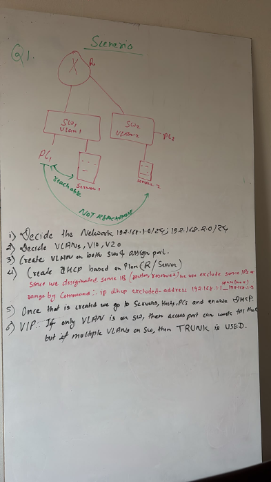
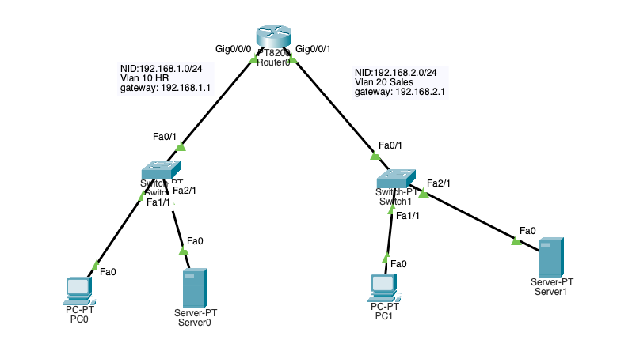
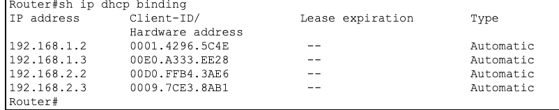
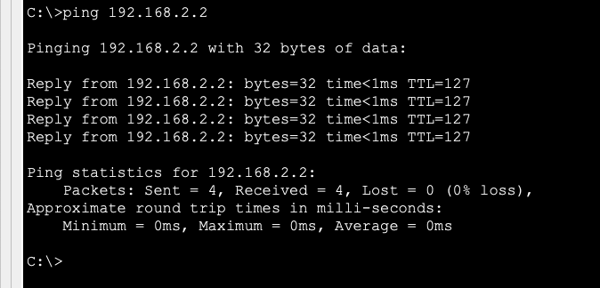

# Q01 — Inter-VLAN Routing and DHCP Troubleshooting Lab

## Scenario

A user can reach a server in the **same VLAN**, but cannot reach a server located in **another VLAN**.

This scenario can have several possible causes, including:

- A Layer 3 routing problem
- An incorrect default gateway
- An incorrect subnet mask
- A routed interface being down or incorrectly configured
- An ACL or other policy blocking the traffic

Rather than only answering the scenario theoretically, I built a working network from scratch in **Cisco Packet Tracer** to understand how VLANs, DHCP, default gateways, and routing work together.

---

## Lab Objectives

The objectives of this lab are to:

- Create two separate VLANs
- Place end devices into the correct VLANs
- Use separate IPv4 networks for each VLAN
- Configure router interfaces as the default gateways
- Configure the router as a DHCP server
- Dynamically assign IPv4 addressing to end devices
- Enable communication between the two networks
- Verify same-VLAN and inter-network connectivity
- Troubleshoot configuration problems encountered during the lab

The workflow for the lab is:

```text
Design the Networks
        ↓
Create the VLANs
        ↓
Assign Switchports
        ↓
Configure Router Interfaces
        ↓
Configure DHCP
        ↓
Obtain Client Addresses
        ↓
Test Connectivity
        ↓
Troubleshoot
        ↓
Verify End-to-End Communication
```

---

## Network Design

I used two separate networks and VLANs:

| Department | VLAN | Network | Default Gateway |
|---|---:|---|---|
| HR | 10 | `192.168.1.0/24` | `192.168.1.1` |
| Sales | 20 | `192.168.2.0/24` | `192.168.2.1` |

A single router connects both networks.

```text
             R1
        /           \
192.168.1.1       192.168.2.1
     |                 |
   VLAN 10           VLAN 20
     HR               Sales
     |                 |
    SW1               SW2
```

Because both networks are directly connected to the same router, a dynamic routing protocol is not required for communication between them.

---

> **Lab approach:** Build a fully working network first, understand why each component is required, test connectivity, and document any problems encountered during implementation.


---

## Planning the Lab

Before building the topology in Cisco Packet Tracer, I first worked through the scenario on a whiteboard.



The initial design separated the end devices into two networks:

```text
HR
VLAN 10
192.168.1.0/24

Sales
VLAN 20
192.168.2.0/24
```

A single router was then used to connect the two networks and provide Layer 3 communication between them.

This planning stage helped me identify the components required before beginning the configuration:

```text
VLANs
   ↓
Correct Access Ports
   ↓
Default Gateways
   ↓
DHCP
   ↓
Routing
   ↓
Connectivity Testing
```

---

## Final Packet Tracer Topology

I then implemented the design in Cisco Packet Tracer.



The router uses one physical interface for each network:

| Router Interface | IP Address | Connected Network |
|---|---|---|
| `G0/0/0` | `192.168.1.1/24` | VLAN 10 / HR |
| `G0/0/1` | `192.168.2.1/24` | VLAN 20 / Sales |

These router interfaces also act as the default gateways for devices in their respective networks.

```text
192.168.1.0/24                    192.168.2.0/24
     VLAN 10                           VLAN 20
        |                                 |
       SW1                               SW2
        |                                 |
  192.168.1.1                       192.168.2.1
        \                               /
         \                             /
                    R1
```

Because both networks are directly connected to R1, I did not need to configure a dynamic routing protocol for this topology.

---

## Packet Tracer Lab File

The completed Cisco Packet Tracer project is included in this directory:

```text
Q01-Inter-VLAN-Routing-DHCP.pkt
```

This allows the topology and configurations used in the lab to be opened and tested directly in Cisco Packet Tracer.


---

## Layer 2 Configuration

Before configuring DHCP or testing communication between the networks, I configured the VLANs and assigned the appropriate switchports.

### VLAN 10 — HR

On the HR-side switch, I created VLAN 10:

```cisco
vlan 10
 name HR
```

The interfaces connecting the HR end devices were then configured as access ports in VLAN 10:

```cisco
interface <interface>
 switchport mode access
 switchport access vlan 10
```

The switchport connecting this switch to R1 also needed to belong to VLAN 10 because this link carries only VLAN 10 traffic.

```text
PC / Server
     |
 Access Port
   VLAN 10
     |
    SW1
     |
 Access Port
   VLAN 10
     |
R1 G0/0/0
192.168.1.1
```

### VLAN 20 — Sales

The same approach was used for the second network:

```cisco
vlan 20
 name Sales
```

The Sales end-device ports and the switchport toward R1 were assigned to VLAN 20:

```cisco
interface <interface>
 switchport mode access
 switchport access vlan 20
```

This created two separate Layer 2 broadcast domains:

```text
VLAN 10 / HR                  VLAN 20 / Sales
192.168.1.0/24                192.168.2.0/24
      |                              |
     SW1                            SW2
      |                              |
     R1 ---------------------------- R1
```

> **Key lesson:** A switchport connected to a router is not automatically a trunk. In this topology, each router connection carries only one VLAN, so the router-facing switchports can operate as access ports in their respective VLANs.


---

## Router Interface Configuration

R1 connects directly to both networks and provides the default gateway for each subnet.

I configured the two router interfaces as:

```cisco
interface gigabitEthernet0/0/0
 ip address 192.168.1.1 255.255.255.0
 no shutdown
exit

interface gigabitEthernet0/0/1
 ip address 192.168.2.1 255.255.255.0
 no shutdown
exit
```

The resulting gateway design is:

```text
VLAN 10 / HR
192.168.1.0/24
      |
Default Gateway
192.168.1.1
   G0/0/0
      |
      R1
      |
   G0/0/1
192.168.2.1
Default Gateway
      |
192.168.2.0/24
VLAN 20 / Sales
```

I verified the interfaces using:

```cisco
show ip interface brief
```

Both configured interfaces were operational with their respective IPv4 addresses.

---

## Configuring R1 as the DHCP Server

Rather than manually assigning addresses to every end device, I configured R1 to provide DHCP services for both networks.

### DHCP Pool for VLAN 10

First, I excluded the router's gateway address from the DHCP pool:

```cisco
ip dhcp excluded-address 192.168.1.1
```

I then created the VLAN 10 DHCP pool:

```cisco
ip dhcp pool VLAN10
 network 192.168.1.0 255.255.255.0
 default-router 192.168.1.1
```

The exclusion prevents DHCP from assigning `192.168.1.1` to a client because that address is already used by R1.

---

### DHCP Pool for VLAN 20

I repeated the process for the Sales network:

```cisco
ip dhcp excluded-address 192.168.2.1

ip dhcp pool VLAN20
 network 192.168.2.0 255.255.255.0
 default-router 192.168.2.1
```

Each DHCP pool therefore supplies addressing information appropriate for its own subnet:

| DHCP Pool | Network | Excluded Gateway | Default Router |
|---|---|---|---|
| VLAN10 | `192.168.1.0/24` | `192.168.1.1` | `192.168.1.1` |
| VLAN20 | `192.168.2.0/24` | `192.168.2.1` | `192.168.2.1` |

An important point from this lab is that clients do **not** receive both gateways.

```text
VLAN 10 client
     ↓
Default Gateway
192.168.1.1

VLAN 20 client
     ↓
Default Gateway
192.168.2.1
```

Each client receives the gateway belonging to its own IP network.

---

## Verifying DHCP

After enabling DHCP on the end devices, I verified the leases on R1 using:

```cisco
show ip dhcp binding
```



The DHCP binding table confirmed that R1 had successfully allocated IPv4 addresses to the clients.

This provided evidence that the complete DHCP path was working:

```text
Client
   ↓
DHCP Discover
   ↓
Correct VLAN
   ↓
Switch
   ↓
Router Interface
   ↓
R1 DHCP Pool
   ↓
Address Lease
```


---

## Troubleshooting: DHCP Failed

During the lab, the VLAN 10 clients initially failed to obtain an IPv4 address through DHCP.

Instead of rebuilding the topology, I checked the network one stage at a time.

### Step 1 — Verify the DHCP Pool

On R1, I checked:

```cisco
show ip dhcp pool
```

The output confirmed that the `VLAN10` DHCP pool existed and had available addresses.

This indicated that the DHCP pool itself was not the immediate problem.

---

### Step 2 — Verify the Router Interface

I then checked the Layer 3 interfaces:

```cisco
show ip interface brief
```

R1 showed:

```text
GigabitEthernet0/0/0   192.168.1.1   up   up
GigabitEthernet0/0/1   192.168.2.1   up   up
```

Both gateway interfaces were operational.

At this point, the troubleshooting path became:

```text
DHCP Pool        ✓
Router Interface ✓
        ↓
Check Layer 2
```

---

### Step 3 — Check VLAN Membership

On the switch, I used:

```cisco
show vlan brief
```

The client-facing ports were assigned to VLAN 10, but the switchport connecting the switch to R1 was still assigned to the default VLAN 1.

Conceptually, the broken path looked like:

```text
PC
 |
VLAN 10
 |
SW1
 |
X  VLAN mismatch
 |
Router-facing port
VLAN 1
 |
R1
```

This prevented the VLAN 10 DHCP broadcast from reaching the router through the expected Layer 2 path.

---

## Root Cause

The DHCP server configuration was correct.

The actual problem was **incorrect VLAN membership on the router-facing switchport**.

The end devices were in VLAN 10, while the switchport toward R1 was still in VLAN 1.

This was a Layer 2 configuration problem that appeared to the client as a DHCP failure.

---

## Fix

Because this router connection carries only VLAN 10 in this topology, I configured the router-facing switchport as an access port in VLAN 10:

```cisco
interface <router-facing-interface>
 switchport mode access
 switchport access vlan 10
```

After correcting the VLAN membership, the DHCP clients successfully received addresses from R1.

> **Troubleshooting lesson:** A DHCP failure does not necessarily mean that DHCP itself is incorrectly configured. I need to verify the complete path between the client and DHCP server, including VLAN membership and interface state.

---

## Final Connectivity Test

After configuring both networks correctly, devices could communicate within their own network and across the router to the other network.

I tested communication from a VLAN 10 client to a server in the VLAN 20 network.



The successful ICMP replies confirmed:

```text
VLAN 10 Client
192.168.1.x
      |
      ↓
Default Gateway
192.168.1.1
      |
      ↓
      R1
      |
      ↓
192.168.2.1
Default Gateway
      |
      ↓
VLAN 20 Server
192.168.2.x

      ✓ SUCCESS
```

---

## Why No Routing Protocol Was Required

I used only one router in this lab.

R1 has an interface directly connected to each network:

```text
G0/0/0 → 192.168.1.0/24
G0/0/1 → 192.168.2.0/24
```

Therefore, R1 already knows how to reach both networks as directly connected networks.

There is no second router with which R1 needs to exchange routing information.

For this topology, I therefore did not need:

```text
OSPF
EIGRP
RIP
```

or a static route between these two directly connected networks.

---

## What I Learned

This lab brought several CCNA concepts together in one working topology:

```text
VLANs
  +
Access Ports
  +
IPv4 Subnetting
  +
Default Gateways
  +
DHCP
  +
Routing
  +
Troubleshooting
```

The most important lesson was the relationship between Layer 2 and Layer 3.

A correctly configured DHCP pool on the router was not enough when the Layer 2 path from the client to the router was incorrect.

I also reinforced the distinction between access and trunk links:

```text
One VLAN across a link
        ↓
Access port can be used

Multiple VLANs across one link
        ↓
Trunk required
```

Finally, I learned to troubleshoot systematically rather than immediately changing configurations:

```text
Identify the symptom
        ↓
Verify DHCP
        ↓
Verify Layer 3 interfaces
        ↓
Verify VLAN membership
        ↓
Find the root cause
        ↓
Apply the fix
        ↓
Retest
        ↓
Verify success
```

> **Final takeaway:** Successful communication between VLANs depends on both a correct Layer 2 path and correct Layer 3 addressing/routing. Troubleshooting should verify each layer rather than assuming the visible symptom identifies the actual cause.


